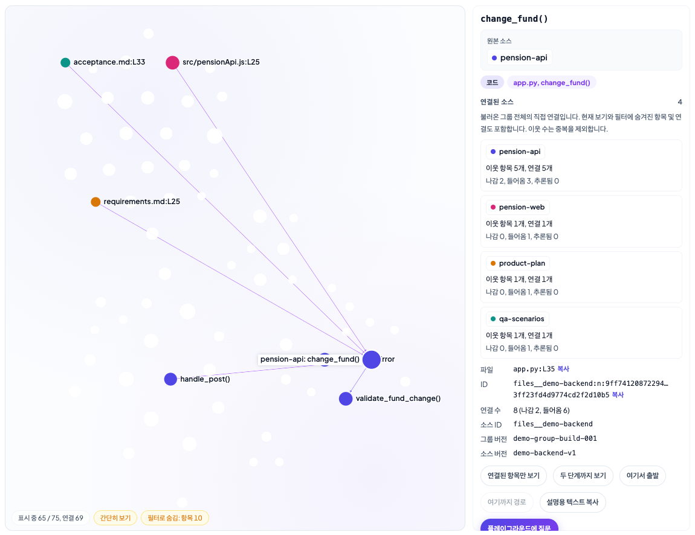
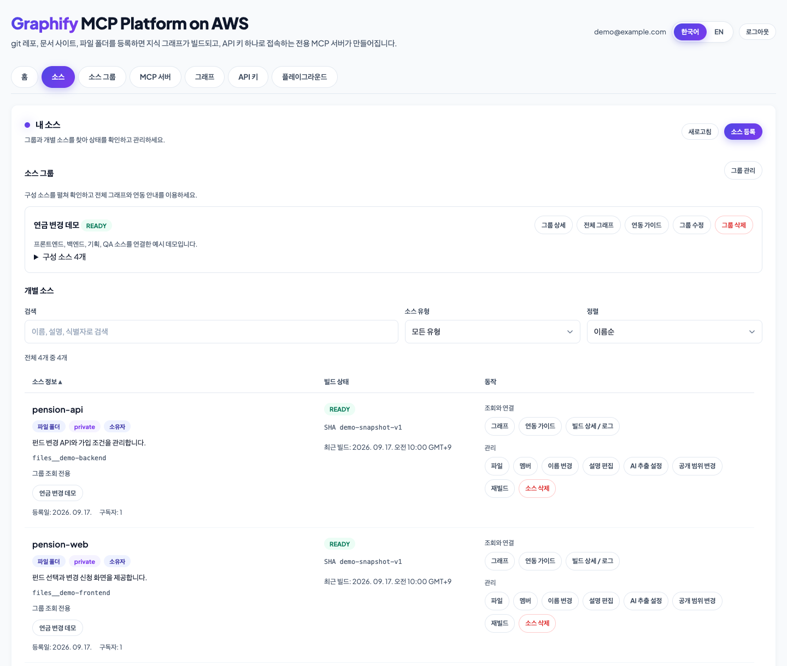
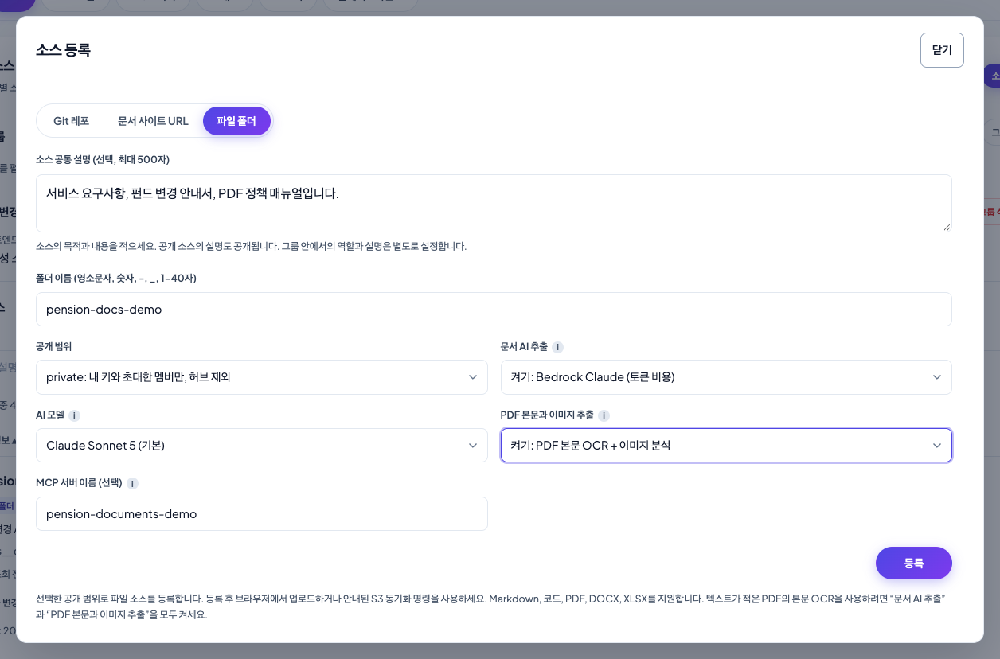
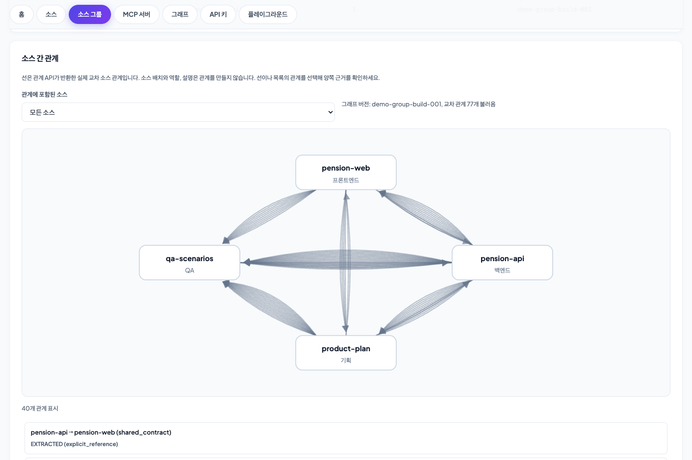
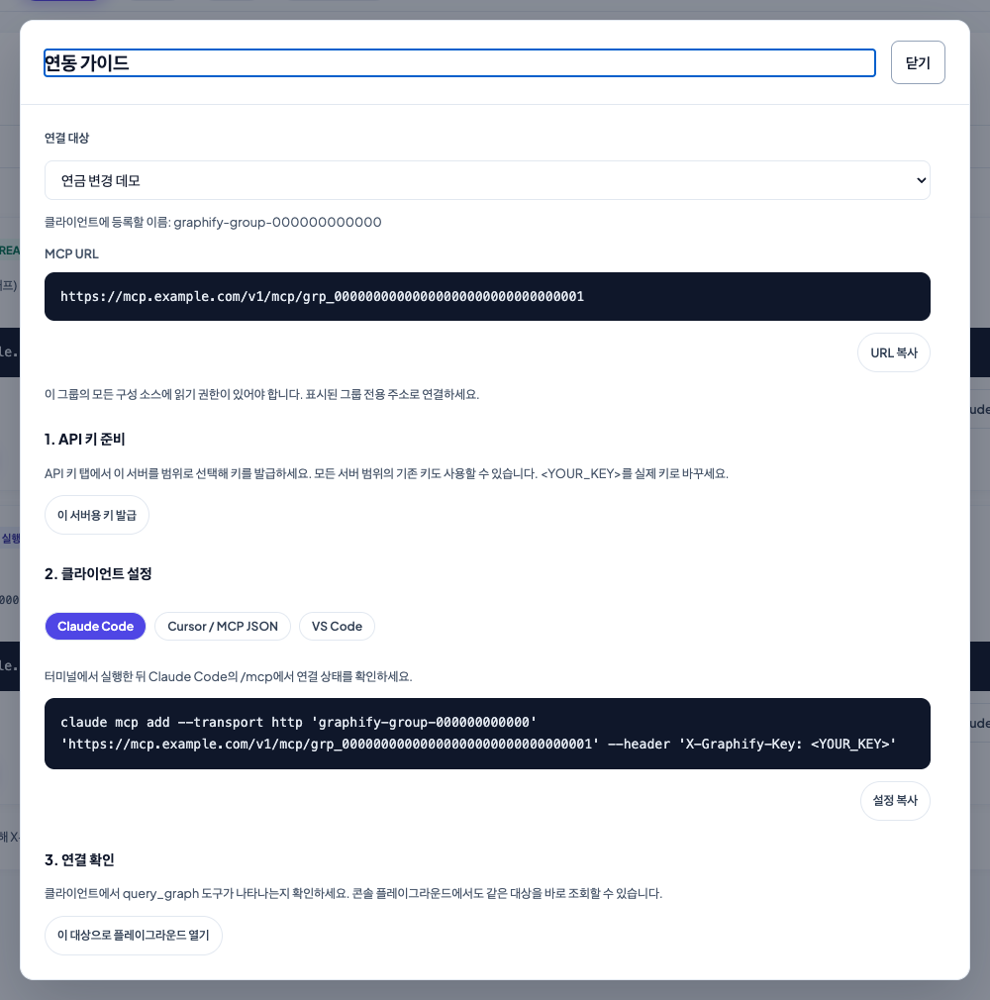
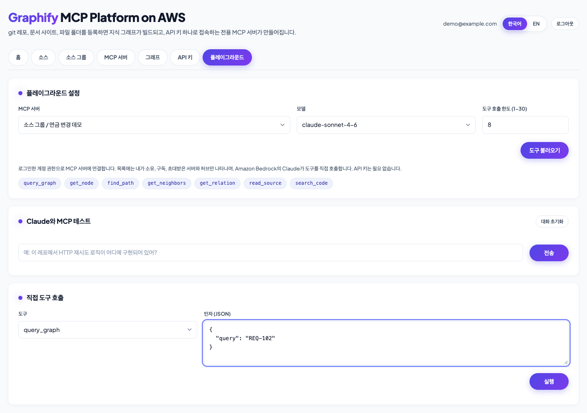
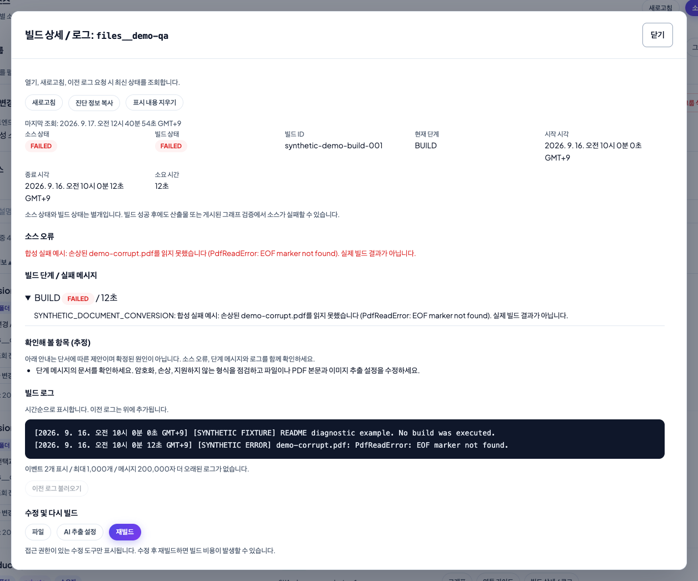
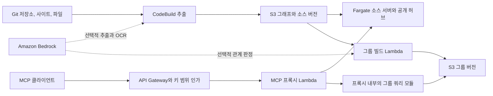

# Graphify MCP Platform on AWS

[English](README.md) | [소스 그룹](docs/source-groups.md) | [빌드 진단](docs/build-diagnostics.md) | [엔지니어링 레퍼런스](docs/reference.md)

코드와 문서의 지식 그래프를 AWS에서 원격 MCP 서버로 제공합니다. 웹 콘솔에 소스를 등록하고 관련 소스를 프로젝트 그래프로 연결하면, AI 어시스턴트가 관계를 탐색하고 근거가 되는 원문을 읽을 수 있습니다.

그래프 생성에는 [graphify](https://github.com/Graphify-Labs/graphify)를 사용합니다. 플랫폼은 소스 관리, 접근 제어, 소스 그룹의 버전 관리, 빌드 진단, 그래프 탐색기, Amazon Bedrock 기반 Claude 플레이그라운드를 제공합니다.

예를 들어 프론트엔드, 백엔드, 요구사항, QA 문서를 각각 별도 소스로 등록할 수 있습니다. 소스 그룹으로 묶으면 여러 소스에 걸친 API나 요구사항의 연결을 추적하고 기록된 근거를 확인할 수 있습니다. AI 코딩 어시스턴트에도 같은 MCP 엔드포인트를 연결할 수 있습니다.



이 저장소는 AWS 샘플입니다. 이 가이드는 배포와 일상적인 운영을 다룹니다. 사용자나 민감한 소스를 등록하기 전에 [프로덕션 배포 고려 사항](#프로덕션-배포-고려-사항)을 검토하세요.

## 시작하기

| 할 일 | 시작할 곳 |
| --- | --- |
| 플랫폼 배포 | [AWS에 배포](#aws에-배포) |
| 코드나 문서 추가 | [첫 소스 등록](#첫-소스-등록) |
| 저장소와 프로젝트 문서 연결 | [소스 그룹 만들기](#소스-그룹-만들기) |
| AI 코딩 어시스턴트 설정 | [MCP 클라이언트 연결](#mcp-클라이언트-연결) |
| 빌드 실패 원인 확인 | [실패한 빌드 진단](#실패한-빌드-진단) |
| 비용 산정 또는 배포 환경 유지 관리 | [비용 계획](#비용-계획)과 [운영](#운영) |

스크린샷은 현재 콘솔에 데모 데이터와 재생한 API 응답을 적용한 화면입니다. 인터페이스를 설명하기 위한 예시이며 벤치마크 결과가 아닙니다. 엔드포인트와 사용자 정보도 예시입니다. [스크린샷 설명과 재현 방법](docs/screenshots/README.md)을 참고하세요.

## 소스, 소스 그룹, 공개 허브

| 개념 | 포함 내용 | 접근 및 제공 방식 |
| --- | --- | --- |
| **소스** | Git 저장소 하나, 문서 사이트 하나 또는 업로드한 폴더 하나 | 공개 또는 비공개로 설정합니다. 일반 소스에는 전용 Fargate MCP 서비스가 있습니다. |
| **소스 그룹** | 기존 소스 최대 8개, 고정된 소스 버전, 기록된 소스 간 관계 | 비공개입니다. 조회하려면 그룹과 모든 구성 소스에 접근 권한이 있어야 합니다. 쿼리는 요청 시 Lambda에서 실행합니다. |
| **공개 허브** (`all`) | 공개 소스의 그래프를 병합한 그래프 | 로그인한 플랫폼 멤버와 해당 범위에 접근할 수 있는 API 키로 이용합니다. 비공개 소스와 비공개 그룹은 포함하지 않습니다. |

여기서 **공개**는 플랫폼 내부 공유를 뜻합니다. 인터넷에서 인증 없이 접근할 수 있다는 뜻은 아닙니다. 이미 등록된 공개 소스를 등록하면 복사본을 만들지 않고 기존 공유 소스를 구독합니다.

그래프의 연결은 관계를 기록한 것입니다. 연결만으로 구현이 요구사항을 충족하거나 테스트가 해당 요구사항을 검증한다고 단정할 수는 없습니다. 연결된 원문을 읽고 판단하세요.

## AWS에 배포

### 사전 준비

- AWS 계정과 IAM 역할을 포함해 [아키텍처](#아키텍처)에 명시된 리소스를 생성할 수 있는 배포 역할이 필요합니다.
- 대상 계정에서 사용할 수 있는 자격 증명이 설정된 AWS CLI v2가 필요합니다.
- Python 3.12 이상과 [uv](https://docs.astral.sh/uv/)가 필요합니다.
- [AWS CDK 사전 요구사항](https://docs.aws.amazon.com/cdk/v2/guide/prerequisites.html)에 따라 Node.js 22 이상이 필요합니다.
- `linux/arm64` 이미지를 빌드할 수 있는 Docker 엔진이 실행 중이어야 합니다. x86 호스트에서는 ARM 에뮬레이션을 설정하세요.
- 문서 AI 추출, PDF OCR, AI 관계 판정 또는 플레이그라운드 채팅을 사용하려면 선택한 Amazon Bedrock 모델에 접근할 수 있어야 합니다. 모델의 가용성과 호출 권한은 계정과 리전에 따라 다릅니다.

### 1. 저장소와 배포 환경 준비

```bash
git clone https://github.com/aws-samples/sample-graphify-mcp-platform-on-aws.git
cd sample-graphify-mcp-platform-on-aws

uv sync
npm ci --prefix lambdas/playground_stream

export AWS_REGION=ap-northeast-2
export AWS_DEFAULT_REGION="$AWS_REGION"
export GRAPHIFY_STACK_NAME=GraphifyMcpPlatform

aws sts get-caller-identity
```

마지막 명령이 반환한 계정을 확인하세요. 이름이 지정된 AWS 프로파일을 사용한다면 위 명령을 실행하기 전에 `AWS_PROFILE`을 설정하세요.

기존 배포를 업데이트할 때는 처음 배포한 리전과 스택 이름을 사용하세요. 다른 스택 이름을 지정하면 기존 배포를 업그레이드하는 대신 별도 스택을 생성합니다.

### 2. 부트스트랩과 배포

```bash
# 대상 계정과 리전에서 한 번만 부트스트랩합니다.
npx -y aws-cdk@2.1139.0 bootstrap

# ARM 런타임 이미지를 빌드하고 스택을 배포합니다.
npx -y aws-cdk@2.1139.0 deploy
```

스택 출력에는 다음 값이 포함됩니다.

| 출력 | 용도 |
| --- | --- |
| `ConsoleUrl` | 웹 콘솔을 엽니다. |
| `McpDataApiUrl` | API 키로 인증하는 MCP 요청의 기본 URL입니다. |
| `PlatformApiUrl` | 콘솔에서 사용하는 관리 API입니다. |

배포 시간은 Docker 이미지 빌드와 AWS 리소스 생성에 따라 달라집니다. 아래 운영 스크립트를 실행할 때도 같은 `GRAPHIFY_STACK_NAME` 환경 변수를 유지하세요.

### 3. 첫 관리자 생성

```bash
uv run python scripts/create_platform_user.py --region "$AWS_REGION" --email admin@example.com --admin
```

다른 사람이 볼 수 없는 터미널에서 실행하세요. 스크립트는 영구 비밀번호와 콘솔 URL을 출력하며 이메일은 보내지 않습니다. 콘솔을 열고 해당 계정으로 로그인하세요.

사용자 풀은 셀프 가입을 허용하지 않습니다. 이후 사용자는 관리자가 **관리자** 메뉴에서 초대합니다. 이미 등록된 이메일로 초기 관리자 생성 스크립트를 다시 실행하면 해당 계정의 비밀번호가 재설정됩니다. 운영 스크립트는 각각 서울 리전을 기본값으로 사용하므로, 다른 리전에서는 `--region`을 지정하세요.

**관리자** 페이지에서는 비밀번호 재설정과 계정 삭제도 할 수 있습니다. 사용자를 삭제하면 해당 사용자의 키가 폐기되고 소스 권한이 제거되며, 소유한 비공개 소스도 종료됩니다. 계정을 삭제하기 전에 공유 중인 작업과 그룹에 미치는 영향을 확인하세요.

### 4. 첫 배포 확인

대규모 문서 모음을 추가하기 전에 다음을 확인하세요.

1. 로그인하고 주요 페이지가 열리는지 확인합니다.
2. 작은 소스를 등록하고 빌드가 끝날 때까지 기다립니다.
3. 그래프를 열고 노드 하나를 원문과 대조합니다.
4. **플레이그라운드**를 열어 소스를 선택하고 도구를 불러온 뒤 `graph_stats`를 `{}` 인자로 호출합니다.
5. 해당 소스로 범위를 제한한 API 키를 발급하고 아래 안내에 따라 클라이언트를 연결합니다.

## 첫 소스 등록

**소스**에서 **소스 등록**을 선택합니다. 등록과 관리 작업은 모달에서 진행하며, 페이지에는 소스 목록이 유지됩니다.



### 소스 유형 선택

| 유형 | 입력할 내용 | 업데이트 방식 |
| --- | --- | --- |
| **Git 저장소** | HTTPS Git URL, 선택 사항인 브랜치/ref, 비공개 저장소용 PAT | 폴링으로 변경을 감지합니다. 직접 관리하는 GitHub 저장소는 웹훅을 사용할 수 있습니다. |
| **문서 사이트 URL** | 크롤링할 호스트와 경로 접두사가 포함된 HTTPS URL | 예약된 크롤링은 `robots.txt`를 준수하고 지정 범위 안에서 수행합니다. |
| **파일 폴더** | 폴더 이름을 입력한 뒤 코드, Markdown, PDF, DOCX, XLSX 파일 업로드 | 업로드 경로의 변경을 감지해 다시 빌드합니다. |

소스가 담당하는 내용을 짧게 설명하세요. 예를 들어 “백엔드 라우트, 계정 검증, 펀드 변경 규칙”처럼 작성할 수 있습니다. 공개 허브에 포함하면 안 되는 자료는 비공개로 설정하세요. PAT를 사용하는 소스는 비공개로 등록됩니다.

파일 소스는 등록을 마친 뒤 파일을 업로드하세요. 등록 결과 모달에서 브라우저 업로드와 S3 동기화 명령을 제공합니다. 브라우저 업로드는 콘솔 인증을 사용하며, S3 동기화 명령에는 AWS 자격 증명이 필요합니다. 빈 폴더로는 유용한 그래프를 만들 수 없습니다.

검색 대상으로 제공할 자료만 업로드하세요. `.env`, `.mcp.json`, 자격 증명, 개인 키는 업로드 폴더와 저장소 스냅샷에 포함하지 마세요.

### 문서 추출 설정 선택



| 설정 | 동작 | 사용할 때 |
| --- | --- | --- |
| **문서 AI 추출** | Bedrock을 사용해 문서 내용에서 개념과 관계를 추출합니다. 기본값은 quick-scan 추출입니다. | 제목과 구조만으로는 표현하기 어려운 문서의 의미상 관계가 필요할 때 사용합니다. |
| **PDF 본문과 이미지 추출** | 문서 AI 추출이 켜져 있으면 텍스트가 부족한 PDF 페이지를 검색 가능한 Markdown으로 변환하고 이미지 분석을 활성화합니다. | 스캔한 페이지, 추출 가능한 텍스트가 적은 PDF, 관련 그림이 있을 때 사용합니다. |
| 소스 그룹의 **AI 관계 판정 (선택)** | 빌드가 끝난 소스 사이의 관계 후보를 평가합니다. 기본값은 꺼짐입니다. | 명시적 참조 외에 모델이 추론한 소스 간 관계도 필요할 때 사용합니다. |

세 설정은 별개입니다. 그룹의 AI 관계 판정을 켜도 OCR이 활성화되거나 불완전한 소스 변환이 보완되지는 않습니다.

이 릴리스의 문서 추출 기본 모델은 Claude Sonnet 5입니다. 콘솔은 추출 모델 목록을 API에서 가져옵니다. 플레이그라운드는 별도의 모델 허용 목록을 사용하므로 두 선택 목록이 다를 수 있습니다. 계정에서 호출할 수 있는 모델을 선택하세요.

PDF 본문 복구는 현재 PDF에서 직접 추출한 문자와 숫자가 50자 미만인 페이지를 대상으로 하며, 한글도 글자 수에 포함합니다. 텍스트가 충분한 페이지의 모든 표 셀이나 다이어그램까지 추출된다는 보장은 없습니다. 중요한 금액, 표, 절차는 원본 문서와 대조하세요. 변환 보고서는 일부만 처리되었거나 지원하지 않는 입력을 기록하며, 열 수 없는 암호 보호 PDF도 포함합니다.

변환한 문서는 텍스트로 검색합니다. Markdown 줄 번호는 원본 PDF 페이지 번호나 Excel 셀 주소와 다릅니다. 처리 방식과 실패 규칙은 [PDF 본문 복구와 변환 보고서](docs/document-sources-ops.md#pdf-body-recovery-when-image-extraction-is-enabled)를 참고하세요.

### 소스 사용 가능 여부 확인

빌드가 성공하면 그래프를 열어 알고 있는 심볼이나 문서 용어를 찾아보세요. 해당 항목 주변에 게시된 원문도 읽어보세요. `READY`는 게시가 완료되었다는 뜻이며, 추출의 완전성이나 답변의 정확성을 보장하지 않습니다.

일반 소스의 MCP 엔드포인트를 사용하려면 **MCP 서버**에서 런타임 상태도 확인하세요. 소스 빌드 상태와 런타임 상태는 별개입니다. 운영자는 `scripts/register_repo.py --no-runtime`으로 소스를 등록해 전용 Fargate 서비스 없이 그룹을 통해 사용할 수 있습니다. 이 옵션은 그룹을 만들거나 소스 빌드를 비활성화하지 않으며, 콘솔 등록 화면에서 제공하는 설정도 아닙니다.

## 소스 그룹 만들기

하나의 작업이 여러 소스에 걸쳐 있으면 그룹을 사용하세요. 각 소스는 독립적으로 유지 관리하고, 프로젝트에서 맡은 역할을 설명하세요.

| 소스 예시 | 그룹 내 역할 | 설명 예시 |
| --- | --- | --- |
| 프론트엔드 코드 | `frontend` | 화면, 클라이언트 측 검증, 계정 API 호출. |
| 백엔드 코드 | `backend` | API 라우트, 서비스 로직, 검증 규칙. |
| 요구사항과 설계 문서 | `planning` | 요구사항 ID, 기대 동작, API 명세. |
| 테스트 계획과 인수 테스트 케이스 | `qa` | 테스트 케이스 ID, 사전 조건, 기대 결과. |

1. 각 소스를 성공적으로 빌드합니다. 변경 불가능한 버전 산출물이 없는 기존 소스는 한 번 다시 빌드해야 합니다.
2. **소스 그룹**에서 **그룹 만들기**를 선택합니다.
3. 그룹 이름과 설명을 입력합니다. 소스를 1개에서 8개까지 선택하고 역할과 그룹 내 설명을 지정합니다.
4. 그룹을 저장한 뒤 **관계 분석 실행**을 선택합니다. 명시적 참조만으로 충분하다면 AI 관계 판정을 끈 상태로 시작하세요.
5. 생성된 관계와 양쪽 원문 인용을 확인합니다. 같은 요구사항 ID는 추적 가능한 참조이며, 검증 범위를 판정한 결과는 아닙니다.
6. **전체 그래프 보기** 또는 **연동 가이드**를 열어 화면이나 MCP에서 그룹을 사용합니다.



그룹은 **소스** 페이지의 별도 영역에도 표시됩니다. 소유자는 그룹을 편집하고 삭제할 수 있고, 편집자는 편집할 수 있으며, 조회자는 읽기만 가능합니다. 그룹을 삭제해도 원본 소스는 유지됩니다.

**그룹 접근 권한은 소스 접근 권한을 부여하지 않습니다.** 모든 멤버는 그룹의 모든 소스에 대한 접근 권한을 유지해야 합니다. 소스를 추가하면 해당 소스의 권한이 없는 멤버는 그룹을 사용할 수 없게 될 수 있습니다. 권한을 복구하거나 그룹에서 해당 소스를 제거한 뒤 필요하면 다시 빌드하세요.

이미 빌드된 그룹은 5분마다 소스 버전과 설명의 변경 여부를 확인합니다. 입력이 바뀌면 재빌드가 시작될 수 있습니다. 실패한 작업은 무한히 재시도하지 않으며 명시적으로 재시도해야 합니다. [소스 그룹 동작, 한도, 접근 규칙](docs/source-groups.md)을 참고하세요.

## 그래프 탐색과 원문 확인

**그래프** 페이지는 소스/폴더, 연관 그룹, **모든 항목** 보기를 제공합니다. 검색과 필터로 범위를 좁힌 뒤 노드를 선택해 관계와 원문을 확인하세요.

소스 그룹에서는 다음 정보를 확인할 수 있습니다.

- 노드를 선택하거나 마우스를 올리면 캔버스에 해당 소스 이름이 표시됩니다.
- 상세 패널 상단에는 **원본 소스**와 **연결된 소스** 카드가 표시됩니다.
- 각 카드는 중복을 제외한 이웃 노드 수와 개별 연결 수를 집계하며, 들어오는 방향과 나가는 방향을 구분합니다.
- 이웃 항목의 각 행에 소스 배지가 표시되어 이름이 같은 노드를 구분할 수 있습니다.
- 소스 간 연결에는 시작 소스의 색상을 사용하고, 같은 소스 내 연결에는 회색을 사용합니다. 추론된 연결은 더 가늘고 옅게 표시하며, 선택 및 경로 강조 표시가 우선합니다.

연결된 소스 요약은 현재 필터로 숨겨진 노드와 연결까지 포함해, 불러온 전체 그래프를 기준으로 집계합니다. 여러 단계를 거쳐 도달할 수 있는 모든 소스가 아닌 직접 연결만 계산합니다.

그룹에서 원문을 읽을 때는 해당 그래프에 고정된 버전을 사용합니다. 버전이나 권한이 더 이상 일치하지 않으면 새로고침하거나 다시 빌드하세요. 뷰어가 최신 원문으로 임의 대체하지 않습니다. 원문을 자동으로 불러올 때는 코드 상자만 스크롤하므로 노드의 소스 요약은 제자리에 유지됩니다.

## MCP 클라이언트 연결

### 1. 엔드포인트와 키 범위 선택

**MCP 서버** 또는 소스 그룹의 **연동 가이드**를 여세요. 클라이언트에서 조회할 소스, 그룹 또는 공개 허브를 선택합니다.

**API 키**나 연동 가이드에서 해당 엔드포인트용 키를 발급합니다. 클라이언트에 특정 소스나 그룹만 필요하다면 키의 접근 범위를 명시적으로 제한하세요. 키는 한 번만 표시되고 만료일을 지정할 수 있으며, 콘솔에서 폐기할 수 있습니다. 키가 포함된 클라이언트 설정은 버전 관리에 포함하지 마세요.



연동 가이드는 Claude Code, Cursor, VS Code용 설정을 생성합니다. 클라이언트마다 설정을 담는 구조가 다르므로 사용하는 클라이언트의 형식을 복사하세요.

### 2. Claude Code에 서버 추가

`/v1/mcp/<server-id>`를 포함해 연동 가이드에 표시된 엔드포인트를 그대로 사용하세요.

```bash
export GRAPHIFY_MCP_URL='https://<api-id>.execute-api.<region>.amazonaws.com/v1/mcp/<server-id>'

# 발급받은 키를 붙여 넣고 Enter를 누릅니다. 입력 내용은 표시되지 않습니다.
read -r -s GRAPHIFY_API_KEY
```

키를 입력한 뒤 같은 터미널에서 다음 명령을 실행하세요.

```bash
claude mcp add --transport http graphify-project "$GRAPHIFY_MCP_URL" \
  --header "X-Graphify-Key: $GRAPHIFY_API_KEY"
```

MCP 클라이언트는 `X-Graphify-Key`로 인증하며 AWS 자격 증명은 필요하지 않습니다. 엔드포인트는 Streamable HTTP를 사용하며 OAuth 로그인은 제공하지 않습니다.

새 키가 API Gateway 사용량 플랜에 반영되기까지 약 1분이 걸릴 수 있습니다. 클라이언트에서 인증 오류가 발생하면 먼저 엔드포인트와 키 범위를 확인한 뒤, 반영을 기다렸다가 다시 연결하세요.

### 3. 연결 확인

클라이언트에 서버의 도구 목록을 요청하세요. 같은 엔드포인트를 직접 확인할 수도 있습니다.

```bash
curl --fail-with-body --silent --show-error \
  -X POST "$GRAPHIFY_MCP_URL" \
  -H "X-Graphify-Key: $GRAPHIFY_API_KEY" \
  -H 'Content-Type: application/json' \
  -H 'Accept: application/json, text/event-stream' \
  --data '{"jsonrpc":"2.0","id":1,"method":"tools/list"}'
```

HTTP 성공 응답만으로는 충분하지 않습니다. JSON-RPC 응답에 `error` 대신 `result.tools`가 있는지 확인하세요. 도구 인자는 서버가 반환한 스키마를 기준으로 작성합니다. 개별 소스와 그룹의 스키마는 다를 수 있습니다.

### 도구와 작업 예시

| 작업 | 일반 소스 또는 공개 허브 | 소스 그룹 |
| --- | --- | --- |
| 노드 검색과 조회 | `query_graph`, `get_node` | `query_graph`, `get_node` |
| 관계 탐색 | `get_neighbors`, `shortest_path` | `get_neighbors`, `find_path` |
| 관계의 근거 확인 | 노드와 연결 메타데이터 | `get_relation`으로 저장된 근거 조회 |
| 그래프 구조 요약 | `get_community`, `god_nodes`, `graph_stats` | 별도의 `graph_stats` 도구 없음 |
| 원문 검색과 읽기 | `search_code`, `read_source`는 개별 소스에서만 제공하며 허브에서는 사용할 수 없음 | 버전을 확인하는 `search_code`, `read_source` |

`query_graph`의 입력도 다릅니다. 일반 소스는 `{"question":"fund change"}`, 그룹은 `{"query":"REQ-102"}`를 받습니다. 그룹의 원문 검색은 대소문자를 구분하는 리터럴 검색이며, 일반 소스는 정규식과 대소문자 구분 옵션도 지원합니다. 선택한 서버가 반환하는 스키마를 확인하세요.

graphify가 제공하는 PR 도구(`list_prs`, `get_pr_impact`, `triage_prs`)는 일반 소스와 허브의 도구 목록에도 표시되지만, 체크아웃과 `gh`가 필요합니다. 이 배포는 PR 작업용으로 해당 의존성을 준비하지 않습니다. 그룹 엔드포인트는 이 PR 도구들을 노출하지 않습니다.

코딩 어시스턴트에 다음과 같이 요청할 수 있습니다.

> 펀드를 변경하는 라우트를 찾아 주세요. 백엔드의 검증 호출을 따라간 뒤 프론트엔드 호출 위치와 연결된 요구사항 또는 QA 참조를 보여 주세요. 소스 파일을 인용하고, 저장된 연결과 직접 추론한 결론을 구분해 주세요.

> 이 API 응답 필드를 변경하기 전에 직접 연결된 호출부와 테스트를 확인해 주세요. 관련 원문 범위를 읽고 그래프만으로 확인할 수 없는 내용을 정리해 주세요.

## 플레이그라운드에서 테스트

접근 가능한 서버를 선택하고 도구를 불러온 뒤, 도구를 직접 호출하거나 Claude와 대화하세요. 플레이그라운드는 로그인한 사용자의 권한을 사용하므로 API 키를 붙여 넣을 필요가 없습니다.



먼저 도구를 직접 호출해 연결 상태와 모델 동작을 구분해 확인하세요. 일반 소스에서는 `graph_stats`를 `{}`로 호출하고, 예시 그룹에서는 `query_graph`를 `{"query":"REQ-102"}`로 호출합니다. 이어서 답을 알고 있는 간단한 질문을 하고 반환된 원문 근거를 확인하세요.

턴당 도구 라운드 한도는 1에서 30까지 설정할 수 있으며 기본값은 8입니다. 한도를 늘리면 더 많이 탐색할 수 있지만 지연 시간과 Bedrock 토큰 비용이 증가할 수 있습니다. 응답 생성을 멈추려면 **중지**를 선택하세요. 문서 추출, 그룹 AI 관계 판정, 플레이그라운드 채팅은 각각 모델을 사용합니다.

## 실패한 빌드 진단

**소스**에서 해당 소스의 **빌드 상세 / 로그**를 여세요.



*이 스크린샷은 진단 패널을 설명하기 위해 만든 가상 실패 사례입니다.*

1. 소스 상태와 최근 CodeBuild 상태를 비교합니다. CodeBuild 실행이 성공해도 그래프 게시에 실패하면 소스는 실패 상태로 남을 수 있습니다.
2. 실패한 단계, 오류 전후 내용, 최근 로그를 읽습니다. 같은 빌드의 앞선 이벤트는 **이전 로그 불러오기**로 확인합니다.
3. 입력이나 설정을 수정합니다. 해당하는 경우 패널에서 파일, AI 추출, 크롤링 설정으로 이동할 수 있습니다.
4. 다시 빌드하고 진단 정보를 새로고침한 뒤, 게시된 그래프와 원문을 확인합니다.

조치 안내는 오류 키워드를 기준으로 제시하는 확인 항목이며, AI가 근본 원인을 진단한 결과는 아닙니다. 로그 부재와 권한 오류는 별도 상태로 표시합니다. 접근 규칙과 로그 한도는 [빌드 진단](docs/build-diagnostics.md)을 참고하세요.

| 증상 | 확인할 내용 |
| --- | --- |
| Git 인증 실패 | 저장소 URL/ref와 PAT의 읽기 권한. |
| Bedrock 접근 또는 모델 오류 | 계정의 모델 접근 권한, 추론 프로파일, 호출 역할의 권한. |
| OCR 또는 변환 실패 | 오류에 명시된 파일/페이지, 암호 보호 여부, 크기 및 페이지 수 한도, 변환 보고서. |
| 시간 초과, 요청 제한 또는 메모리 오류 | 빌드 시간, CodeBuild 크기, 서비스 할당량, 문서 모음의 크기. 한도를 초과한 빌드를 변경 없이 반복하지 마세요. |
| 그룹에서 원문 근거를 읽을 수 없음 | 소스 권한, 변경 불가능한 버전의 존재 여부, 그룹 재빌드 필요 여부. |
| 클라이언트가 401 또는 403을 받음 | 발급된 키, 만료 여부, 엔드포인트 범위, 사용량 플랜 반영 상태, 응답의 `hint`. |
| 그래프 페이지가 렌더링되지 않음 | WebGL 지원 여부와 SRI로 고정한 CDN 스크립트에 대한 접근. |

## 아키텍처



| 구성 요소 | 역할 |
| --- | --- |
| 빌드 파이프라인 | EventBridge, Lambda, CodeBuild가 변경을 감지하고 그래프를 추출하며, 소스 스냅샷을 게시하고 빌드 상태를 기록합니다. |
| 일반 소스 제공 | 소스당 ARM Fargate 태스크 하나와 공개 허브가 S3에서 그래프를 불러옵니다. 소스 태스크는 스냅샷 검색과 읽기 도구도 제공합니다. |
| 소스 그룹 | Lambda 워커가 변경 불가능한 버전과 관계를 조합합니다. 쿼리는 MCP 프록시 Lambda의 공유 모듈에서 처리합니다. |
| 접근과 사용량 | API Gateway, Lambda 인가, DynamoDB가 키 범위를 적용하고 사용량을 기록합니다. 그룹 쿼리는 소스 접근 권한과 버전도 다시 확인합니다. |
| 콘솔 | S3와 CloudFront가 브라우저 앱을 제공합니다. Cognito가 관리 API를 사용할 사용자를 인증합니다. |
| 플레이그라운드 | Lambda가 Bedrock을 호출하고 프록시 Lambda를 통해 허용된 MCP 도구를 실행합니다. 채팅 출력은 별도 스트리밍 경로로 전달합니다. |

일반 소스 그래프는 대체로 미리 계산한 시각화 번들을 사용합니다. 그룹 그래프는 인증된 페이지 단위 그래프 조회와 브라우저 레이아웃 계산을 사용합니다. 따라서 소스 그룹의 렌더링은 일반 소스 번들과 다른 레이아웃 처리 경로를 사용합니다.

## 설정과 한도

배포와 스크립트 실행에서 계정, 리전, 스택 이름, 런타임 이름을 일관되게 사용하세요.

| 배포 설정 | 기본값 | 용도 |
| --- | --- | --- |
| `stack_name` / `GRAPHIFY_STACK_NAME` | `GraphifyMcpPlatform` | CloudFormation 스택 선택. |
| `runtime_name` | `graphify_mcp` | 1~48자. 영문자로 시작하며 이후에는 영문자, 숫자, 밑줄을 사용할 수 있습니다. |
| `build_compute` | `large` | CodeBuild 프로젝트 크기: `small`, `medium`, `large`. |
| `hub_cpu`, `hub_memory` | `2048`, `4096` | 허브 태스크의 CPU 유닛과 메모리(MiB). |
| `github_token_secret_arn` | 미설정 | GitHub 폴링에 사용하는 선택적 PAT 시크릿. |
| `nag` | 꺼짐 | `-c nag=true`로 AwsSolutions 검사 실행. |

소스별 태스크 크기, 폴링, 빌드 시간 제한, 가지치기, 추출 설정은 배포 기본값과 별개입니다. 일부는 콘솔에서 제공하지 않는 운영자용 설정입니다. 정확한 필드는 [엔지니어링 레퍼런스](docs/reference.md)와 소스 API 코드를 참고하세요.

| 한도 | 현재 동작 |
| --- | --- |
| 그룹당 소스 수 | 최대 8개. |
| 그룹 그래프 | 최대 32 MiB, 노드 50,000개, 연결 200,000개. 구성 소스의 그래프도 버전 산출물 한도인 32 MiB 이하여야 합니다. |
| 그룹 근거 텍스트 | 파일당 최대 2 MiB, 그룹당 최대 32 MiB. |
| 일반 런타임 그래프 | 512 MiB를 넘는 그래프는 제공할 수 없습니다. 범위를 줄이거나 소스를 나누세요. 더 작은 그래프도 메모리 제약을 받을 수 있습니다. |
| 원문 읽기 | 호출당 최대 400줄. |
| 브라우저 파일 업로드 | 파일당 최대 100 MiB. |
| 파일 모음 수집 | 최대 20,000개 파일, 총 1 GiB. |
| 소스 스냅샷 | 압축 크기 최대 200 MiB. 파일 소스 스냅샷이 한도를 넘으면 빌드가 실패합니다. Git/URL 소스의 스냅샷은 생성과 게시를 시도하지만 보장하지 않습니다. |
| PDF 변환 | PDF당 최대 2,000페이지. 한도를 넘는 변환은 명시적으로 실패 처리합니다. |
| PDF OCR | 기본값은 빌드당 새 페이지 300개이며, 유효한 캐시가 있는 페이지는 재사용합니다. 내장 이미지 선택과는 별개입니다. |
| API 키 | 사용자당 활성 키 최대 10개. |
| 플레이그라운드 | 턴당 도구 라운드 1~30, 기본값 8. |

CodeBuild 프로젝트의 시간 제한은 60분입니다. API로 관리하는 문서 AI 소스는 소스별 재정의 값이 없으면 기본 120분을 적용합니다. 대규모 빌드에서는 실제 소스 설정을 확인하세요. 많은 문서를 가져오기 전에 [문서 처리 한도](docs/document-sources-ops.md)와 [그룹 한도](docs/source-groups.md#cost-and-limits)를 읽어보세요.

## 비용 계획

배포 후 사용하지 않아도 비용이 발생합니다. 허브와 일반 소스별 Fargate 서비스는 계속 실행됩니다. 그룹을 만들어도 상시 실행되는 Fargate 서비스가 추가되지는 않으며, 기존 소스를 그룹으로 묶어도 해당 소스의 서비스가 중지되지는 않습니다.

서비스당 태스크 하나를 실행하는 기본 설정에서 일반 소스 3개와 그룹 2개를 사용하면 **Fargate 태스크는 4개**입니다. 허브 하나와 소스 태스크 3개이며, 그룹 2개에는 요청에 따른 처리 비용과 저장 비용이 추가됩니다.

| 비용 항목 | 산정 또는 제어 방법 |
| --- | --- |
| Fargate와 퍼블릭 IPv4 | 실행 중인 태스크 수, CPU/메모리, 실행 시간을 계산합니다. 사용하지 않는 소스 서비스는 제거하세요. |
| 소스 빌드 | CodeBuild 크기, 빌드 시간, 빈도를 기준으로 계산합니다. 큰 문서와 재시도가 빌드 시간의 상당 부분을 차지할 수 있습니다. |
| Bedrock | 의미 기반 추출, PDF OCR, 연관 그룹 이름 생성, 선택적 그룹 관계 판정, 플레이그라운드 턴을 포함합니다. 모델별 입력과 출력 토큰을 기록하세요. |
| 그룹 처리 | Lambda 실행 시간, S3 읽기, 저장된 버전을 계산합니다. 변경이 없는 소스 쌍은 이전 판정을 재사용할 수 있습니다. |
| 저장과 요청 | 업로드, 스냅샷, 그래프 버전, 로그, API 요청, DynamoDB, 데이터 전송을 포함합니다. |

[AWS Pricing Calculator](https://calculator.aws/)에서 리전과 워크로드를 기준으로 산정하세요. 토큰 단위로 과금하는 모델은 다음과 같이 계산합니다.

```text
Bedrock 비용 = 입력 토큰 / 1,000,000 × 입력 단가
             + 출력 토큰 / 1,000,000 × 출력 단가
```

캐싱과 기타 요금은 해당 모델의 현재 가격을 기준으로 반영하세요. 그룹의 토큰 예약량은 한도이며 청구된 사용량이 아닙니다. 사용량 데이터가 없다고 비용이 0인 것은 아닙니다.

실제 자료의 특성을 대표하는 작은 문서 모음으로 시작하세요. 캐시가 없는 첫 빌드와 캐시를 사용하는 재빌드를 구분해 기록하고 AWS Budgets 알림을 설정하세요. 노드 수만으로 추출 품질을 추정하거나 데모 그래프를 정확도 벤치마크로 제시하지 마세요.

## 프로덕션 배포 고려 사항

팀에 제공하기 전에 다음 설정이 요구사항에 맞는지 검토하세요.

- **소스 공개 범위와 공유:** 공개 콘텐츠는 허브에 포함됩니다. 그룹 멤버십은 소스 권한을 대체하지 않습니다. 신뢰할 수 없는 테넌트를 허용하기 전에 카탈로그와 사용자 검색에 표시되는 필드를 검토하세요.
- **인증:** 적절한 Cognito 비밀번호 정책, MFA, 계정 복구, 사용자 접근 권한 회수 절차를 설정하세요. 사용하지 않는 클라이언트 키는 폐기하세요.
- **네트워크 제어:** 소스 태스크는 프록시 보안 그룹의 인바운드 트래픽을 허용합니다. 서브넷 설계, 아웃바운드 접근, CloudFront/API 보호, 퍼블릭 IPv4 주소 사용을 검토하세요.
- **로그와 데이터 보존:** 빌드 및 Lambda 로그의 보존 기간을 설정하고 업로드와 버전의 보존 정책을 검토하세요. 추출 과정의 원시 진단 데이터도 보호하세요. 로그 마스킹이 모든 비밀 정보를 찾아내지는 못합니다.
- **모델의 데이터 처리:** 민감한 문서나 프롬프트를 보내기 전에 실제로 사용하는 Bedrock 모델, 추론 라우팅, 계정 정책을 검토하세요. 선택 목록에 모델이 표시된다고 호출 권한이 있다고 판단하지 마세요.
- **운영 준비:** cdk-nag 결과, 서비스 할당량, 이미지와 의존성 검사, 예산, 백업과 복구, 통제된 업그레이드 절차를 검토하세요.

이 항목들은 각 배포 환경에 맞춰 검토해야 합니다. 로컬 테스트를 통과했다고 프로덕션 운영 준비가 완료된 것은 아닙니다.

## 운영

### 로컬 변경 검증

오프라인 테스트는 합성 데이터와 모의 AWS 클라이언트를 사용합니다.

```bash
PYTHONPATH=lambdas/shared/python uv run python -B -m unittest discover -s tests -p 'test_*.py'
node --test tests/test_group_graph_ui.cjs tests/test_graph_label_layout.cjs tests/test_graph_source_affinity.cjs
```

콘솔 브라우저 검증에는 기존에 설치된 Playwright와 Chrome을 사용합니다. 스크립트는 패키지를 설치하지 않습니다. 먼저 탐색 테스트를 실행해 오프라인 일관성 테스트에서 사용할 CDN 캐시를 준비하세요. 내려받은 스크립트는 SRI 값으로 검증합니다.

```bash
export GRAPHIFY_PLAYWRIGHT_MODULE=/path/to/existing/playwright
node tests/test_console_group_navigation.cjs
node tests/test_console_group_consistency.cjs
```

다른 테스트는 [콘솔 검증](docs/console-ux.md#local-verification)을 참고하세요. `scripts/`의 라이브 스모크 스크립트는 별도입니다. 일부는 소스를 등록하거나 키를 발급하며, 채팅 검증에는 Bedrock 비용이 발생할 수 있습니다. 의도한 테스트 배포 환경에서 적절한 계정으로만 실행하세요.

### 배포 업그레이드와 유지 관리

```bash
# 스택 변경 사항을 검토한 뒤 원래 스택 이름으로 배포합니다.
npx -y aws-cdk@2.1139.0 diff
npx -y aws-cdk@2.1139.0 deploy

# 런타임 이미지를 변경한 뒤 동적으로 생성된 소스 서비스를 갱신합니다.
uv run python scripts/sync_runtimes.py --region "$AWS_REGION"

# 전용 서비스가 있는 소스 하나의 런타임을 갱신하고 다시 빌드합니다.
export GRAPHIFY_SOURCE_ID='paste-source-id-from-console'
uv run python scripts/update_repo_runtimes.py --region "$AWS_REGION" --rebuild --repo-id "$GRAPHIFY_SOURCE_ID"
```

소스 그룹 관련 변경은 공유 레이어, API, 프록시, 플레이그라운드, 워커, 게시 처리 구성 요소, 콘솔을 함께 배포하세요. 필요한 변경 불가능한 산출물이 없는 소스는 먼저 다시 빌드한 뒤 그룹을 다시 빌드하세요.

런타임 스크립트는 전용 서비스가 있는 소스만 처리합니다. 그룹 전용 소스는 콘솔에서 **재빌드**를 선택하세요. `update_repo_runtimes.py`는 `--no-runtime`으로 등록한 소스를 제외합니다.

관리 기능만 릴리스할 때는 `-c runtime_image_uri=<ECR-URI@sha256:digest>`로 검토된 기존 런타임 이미지를 유지할 수 있습니다. 런타임 코드를 의도적으로 변경하지 않는 경우에만 사용하세요. 그 외에는 새 이미지를 배포하고 소스 서비스를 갱신하세요.

### 리소스 제거

보관할 소스 자료나 그래프 산출물을 먼저 내보내세요. 플랫폼에 키 기록이 남아 있을 때 API 키를 폐기하세요. 그런 다음 원래 `GRAPHIFY_STACK_NAME`과 리전을 사용해 동적으로 생성된 소스별 서비스를 제거한 뒤 스택을 삭제합니다.

```bash
# 제거할 등록 소스마다 반복합니다.
export GRAPHIFY_SOURCE_ID='paste-source-id-from-console'
uv run python scripts/deregister_repo.py --region "$AWS_REGION" --repo-id "$GRAPHIFY_SOURCE_ID" --purge

# 스택이 소유한 데이터와 인프라를 삭제합니다.
npx -y aws-cdk@2.1139.0 destroy
```

스택을 삭제하면 해당 버킷, 테이블, Cognito 풀이 삭제됩니다. 남아 있는 CodeBuild/Lambda 로그 그룹, PAT 시크릿, 동적 API Gateway 키, ECS 태스크 정의 리비전, CDK 부트스트랩 리소스, ECR 이미지와 제거에 실패한 런타임은 별도로 확인하세요. 소스 등록 해제만으로 그룹과 버전 산출물까지 모두 삭제되지는 않습니다. 소스 그룹만 삭제하면 원본 소스가 삭제되거나 일반 런타임이 중지되지 않습니다.

## 저장소 구조

| 경로 | 내용 |
| --- | --- |
| `cdk/` | 인프라와 소스 빌드 파이프라인. |
| `cdk/build_scripts/` | 문서 변환/OCR, 추출, 시각화, 변경 불가능한 소스 버전 게시. |
| `runtime/` | Fargate 그래프 서버 래퍼, 그래프 동기화, 원문 검색과 읽기 도구. |
| `lambdas/group_worker/` | 그룹 구성, 관계 검증, 변경 사항 동기화, 버전 정리. |
| `lambdas/shared/python/` | Lambda가 공유하는 그룹 인가와 쿼리 보조 모듈. |
| `lambdas/platform_api/` | 소스, 그룹, 키, 사용자, 업로드, 빌드 진단 API. |
| `lambdas/playground*` | 버퍼링과 스트리밍 방식의 Bedrock 플레이그라운드 백엔드. |
| `console/` | 한국어와 영어를 지원하는 SPA, 작업 모달, 소스 그룹 페이지, 그래프 탐색기. |
| `tests/` | 오프라인 Python 및 JavaScript 테스트와 콘솔 브라우저 테스트. |
| `scripts/` | 배포 운영 스크립트, 런타임 유지 관리, 라이브 스모크 검증. |
| `docs/` | 상세 가이드, 다이어그램, 스크린샷. |
| `webapp/` | 참고용으로 보관한 이전 localhost 설정 UI. 이 배포에서는 `console/`을 사용하세요. |

## 기여와 보안 문제 제보

기여 방법은 [CONTRIBUTING.md](CONTRIBUTING.md), 보안 문제 제보는 [보안 문제 신고 안내](CONTRIBUTING.md#security-issue-notifications)를 참고하세요.

## 라이선스

이 프로젝트는 [MIT-0 라이선스](LICENSE)를 사용합니다.
