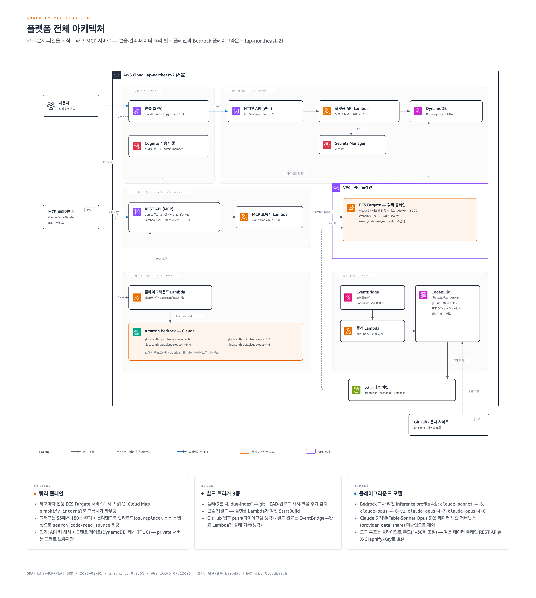
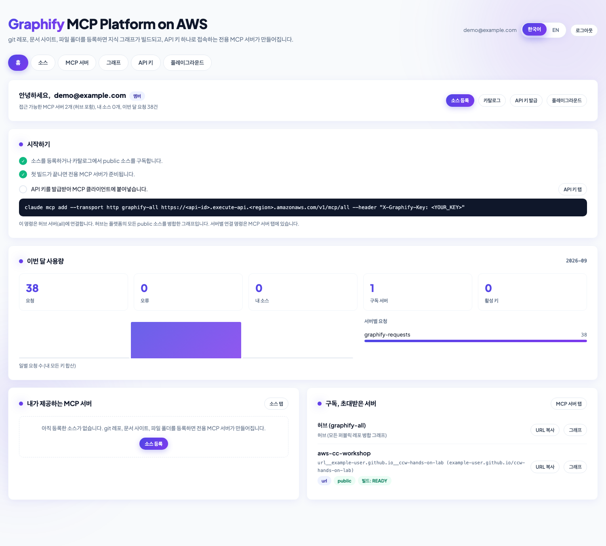
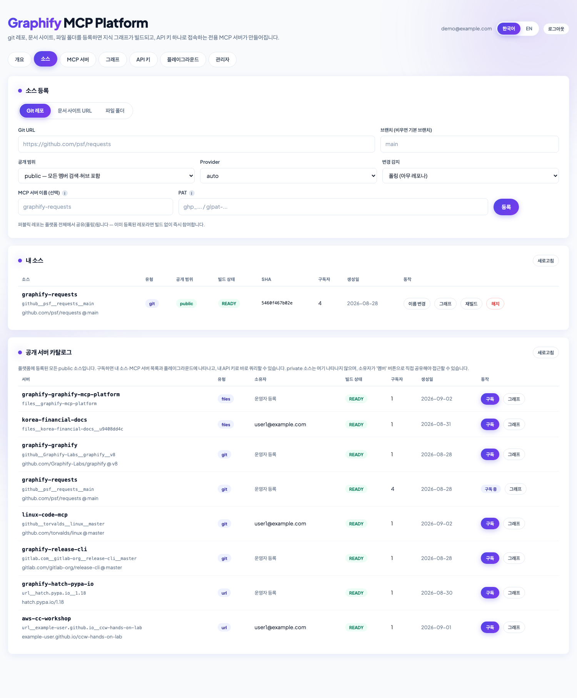
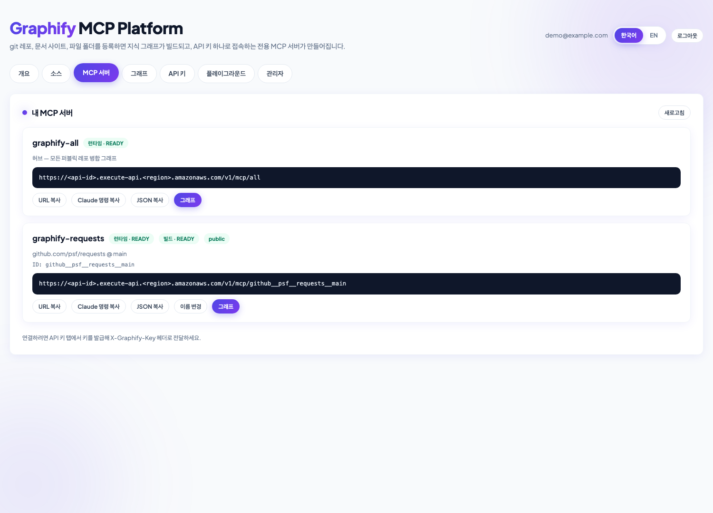
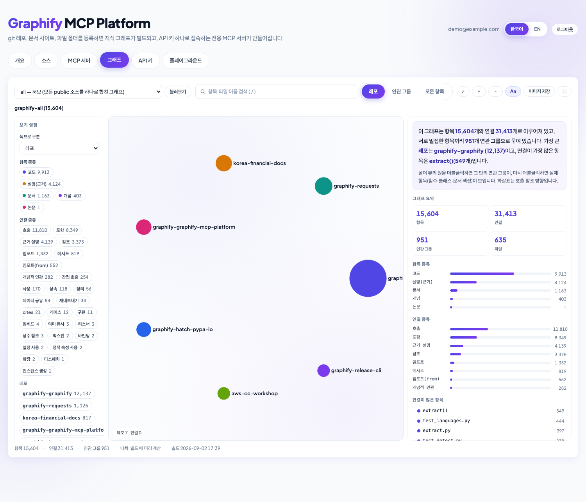
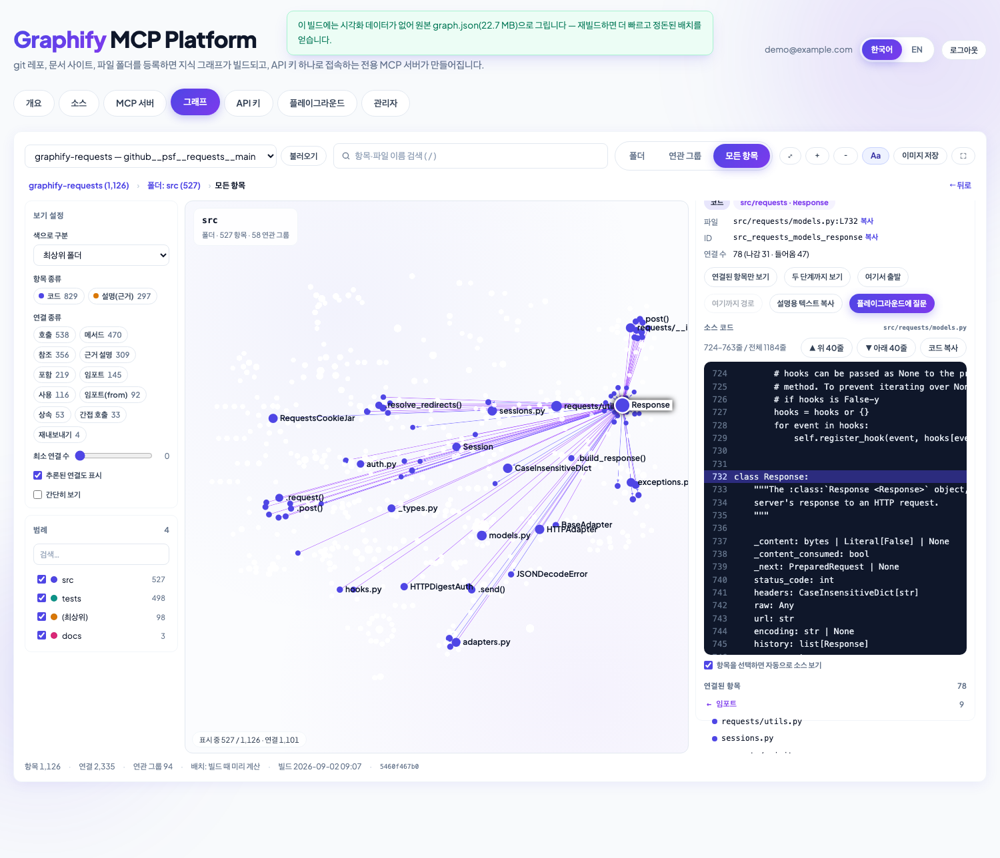
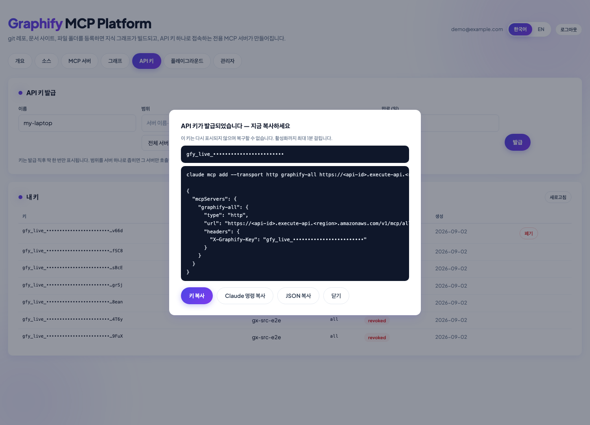
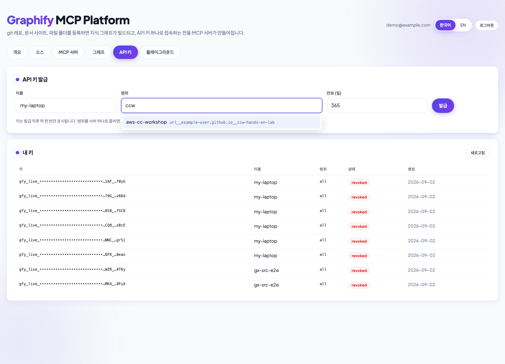
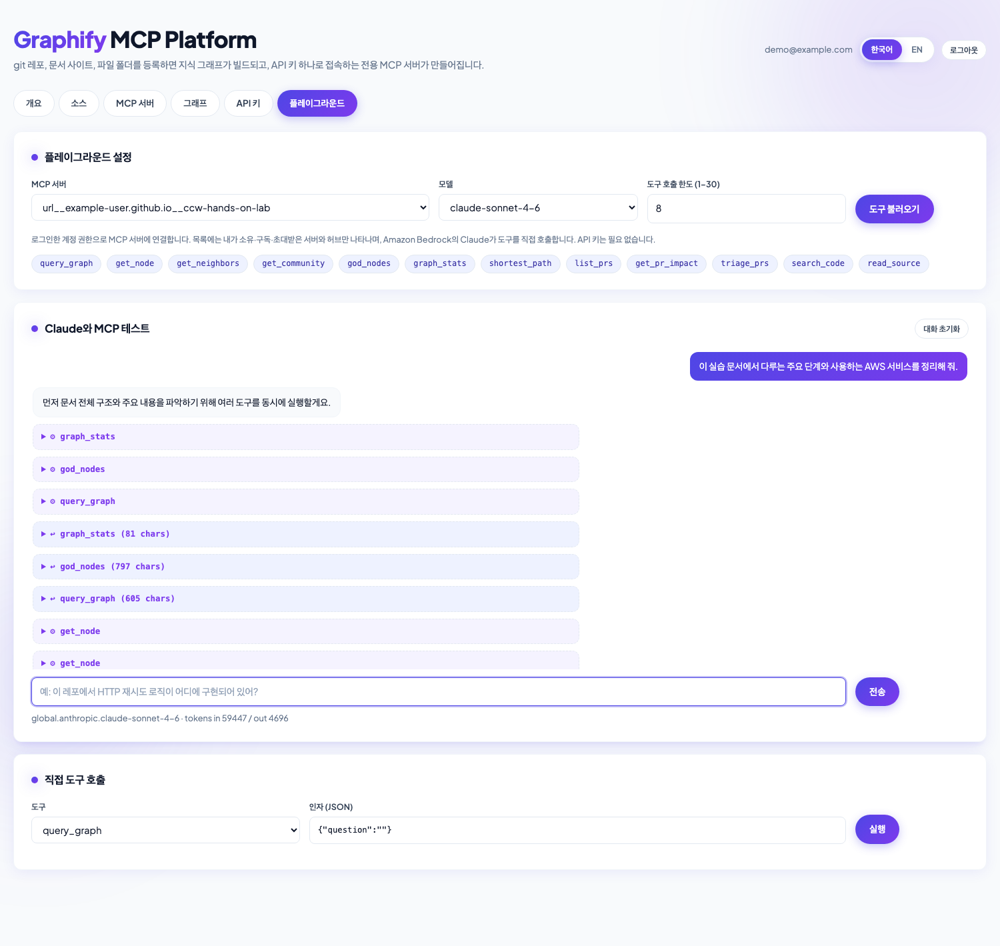
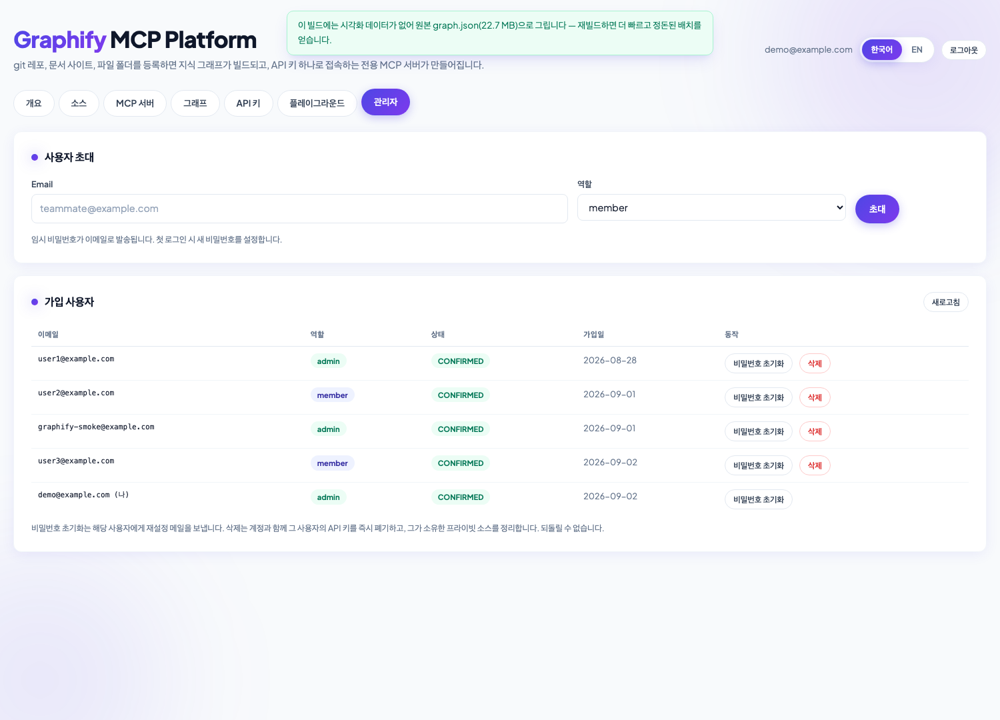

# Graphify MCP Platform on AWS

[**English README**](README.md) · [엔지니어링 레퍼런스](docs/reference.md) · [문서 소스 운영 가이드](docs/document-sources-ops.md)

git 저장소, 문서 사이트, 파일 폴더를 등록하면 지식 그래프가 빌드되고, AI 코딩 에이전트(Claude Code, Cursor, Kiro, Amazon Q Developer 등)가 API 키 하나로 접속하는 **전용 MCP 서버**가 만들어집니다. 셀프서비스 콘솔, 멀티테넌시, 키 기반 인증, 변경 감지 자동 재빌드를 갖춘 플랫폼입니다.

오픈소스 [graphify](https://github.com/Graphify-Labs/graphify) 엔진(AST 추출 + 커뮤니티 탐지로 `graph.json` 생성)을 AWS 네이티브 플랫폼으로 감쌌습니다.


| 플레인         | 역할                                                                                                      | 구성 서비스                                                |
| ----------- | ------------------------------------------------------------------------------------------------------- | ----------------------------------------------------- |
| **빌드**      | 변경 감지(폴링, 웹훅, S3 업로드, 사이트 재크롤), 고정 커밋 기준 증분 재빌드, 그래프/시각화 번들/소스 스냅샷 게시                                   | EventBridge, Lambda, CodeBuild(ARM64), S3             |
| **쿼리**      | 소스마다 상시 기동 MCP 서버 1개와 모든 public 소스를 병합한 **허브** 서버. 그래프는 재배포 없이 라이브 세션에 핫리로드                             | ECS Fargate(Graviton), Cloud Map, VPC                 |
| **데이터**     | `POST /v1/mcp/{serverId}` + `X-Graphify-Key` 헤더. 클라이언트에 AWS 자격 증명이나 SigV4가 필요 없고, 키 단위 범위/스로틀/쿼터/사용량 집계 | API Gateway REST, Lambda 인가자, Lambda 프록시, DynamoDB    |
| **관리 + 콘솔** | 초대 전용 웹 콘솔: 소스 등록, 공개 카탈로그, API 키 발급/폐기, 그래프 시각화, Claude 테스트, 사용자 관리                                    | CloudFront, S3, Cognito, API Gateway HTTP API, Lambda |
| **플레이그라운드** | **Amazon Bedrock**의 Claude가 내 계정이 접근할 수 있는 서버의 MCP 도구를 호출하는 채팅. 스트리밍, Markdown 렌더링, 직접 도구 호출            | Lambda(버퍼 + 응답 스트리밍), Bedrock                         |


> **누구를 위한 샘플인가요?** 원격 MCP 서버를 AWS에서 호스팅하는 방법(테넌시, 키 기반 인증, 웜 컴퓨트, 변경 기반 재빌드, Bedrock 테스트 하네스)의 참조 구현이 필요한 솔루션즈 아키텍트와 플랫폼 팀을 위한 샘플입니다. graphify는 그 위에 올린 구체적인 워크로드입니다. 모든 코드는 샘플이므로 실사용자에게 열기 전에 [보안 고려 사항](#보안-고려-사항)을 먼저 읽어 주세요.

---

## 목차

1. [아키텍처](#아키텍처)
2. [기능과 콘솔 둘러보기](#기능과-콘솔-둘러보기)
3. [사전 준비](#사전-준비)
4. [배포](#배포)
5. [MCP 클라이언트 연결](#mcp-클라이언트-연결)
6. [설정](#설정)
7. [비용](#비용)
8. [제한과 쿼터](#제한과-쿼터)
9. [보안 고려 사항](#보안-고려-사항)
10. [운영](#운영)
11. [저장소 구조](#저장소-구조)
12. [정리](#정리)

---

## 아키텍처



*(인터랙티브 버전: [`docs/architecture.html`](docs/architecture.html), 영문: [`docs/architecture.en.png`](docs/architecture.en.png))*

### 요청 흐름

**빌드(변경 → 그래프).** EventBridge가 5분마다 폴러 Lambda를 호출합니다. 폴러는 점검 시점이 된 소스마다 현재 헤드(GitHub commits API + ETag, 그 외 git 호스트는 smart-HTTP ref 광고, 파일 폴더는 S3 목록 해시, 문서 사이트는 크롤 주기)를 마지막 빌드 리비전과 비교합니다. 변경이 있으면 DynamoDB 조건부 업데이트로 빌드를 선점하고 CodeBuild를 시작합니다. CodeBuild는 정확한 커밋(또는 업로드 폴더·크롤한 페이지)을 가져와 PDF·Word·Excel을 Markdown으로 변환하고(`convert_docs.py`, PDF는 섹션 단위 파트로), `graphify extract`를 증분 실행합니다. AI 추출을 켠 소스는 대신 Bedrock Claude가 문서와 이미지를 의미 단위로 추출합니다. 이어서 커뮤니티 라벨과 그래프 탐색기의 레이아웃 번들(`make_viz.py`)을 만들어 `s3://<bucket>/repos/<repo_id>/latest/`에 게시합니다. 완료 Lambda가 결과를 기록하고, 병합 허브 그래프(`repos/__all__`)는 빌드마다 갱신됩니다.

**서빙(S3 → 라이브 MCP).** Fargate 태스크는 `runtime/entrypoint.py`를 실행합니다. 동기화 스레드가 S3 ETag를 감시하다가 `os.replace()`로 `graph.json`을 원자적으로 교체하면 graphify가 다음 도구 호출에서 그래프를 다시 읽으므로, 변경은 약 3분 안에 라이브 세션에 반영됩니다. 태스크는 소스 스냅샷도 풀어 두어 `search_code`와 `read_source` 두 플랫폼 도구가 그래프 답변을 실제 코드로 뒷받침합니다. 태스크는 VPC 안에 있고 프록시 Lambda의 보안 그룹에서 오는 트래픽만 받습니다.

**쿼리(클라이언트 → 도구 결과).** MCP 클라이언트가 `X-Graphify-Key`를 붙여 `POST /v1/mcp/{serverId}`를 호출합니다. REQUEST 인가자(캐시 TTL 0, 폐기 즉시 반영)가 키를 해시해 DynamoDB에서 범위를 읽고, 범위가 반영된 IAM 정책과 API Gateway 사용량 플랜 식별자를 돌려줍니다. VPC 안의 프록시 Lambda가 Cloud Map DNS로 대상 태스크를 찾아 JSON-RPC 본문을 `:8000/mcp`로 전달하고, 코드에서 범위를 다시 확인한 뒤 키/서버별 사용량 카운터를 올립니다.

**콘솔.** SPA(S3 + CloudFront)는 Cognito 관리형 로그인(PKCE)으로 인증하고 JWT로 HTTP API를 호출합니다. 그래프 탐색기 번들은 짧은 만료의 S3 presigned URL로 내려받습니다. 플레이그라운드는 Lambda에서 Bedrock을 호출하고, 로그인 사용자의 접근 권한(허브는 전원, 그 외 서버는 grant 보유자만)으로 VPC 내부 프록시를 통해 MCP 도구를 실행합니다. API 키는 쓰지 않습니다.

### 테넌시 모델

- **public 소스는 공유(pooled)됩니다.** 빌드 1회, 그래프 1개, Fargate 서비스 1개를 모든 멤버가 함께 씁니다. 두 번째 등록은 구독으로 처리되고(참조 카운트), 구독자가 0이 되면 정리됩니다.
- **private 소스는 격리(siloed)됩니다.** `repo_id`에 소유자 접미사가 붙고 그래프는 허브에 병합되지 않으며, 소유자의 그랜트/키만 서버에 접근합니다. private git 저장소의 PAT는 Secrets Manager에 저장되고 CodeBuild 안에서만 풀립니다.
- **API 키**는 전체 서버 또는 명시한 서버 목록으로 범위를 지정합니다. 허브(`all`)에는 public 그래프만 들어갑니다.

---

## 기능과 콘솔 둘러보기

### 홈: 권한에 맞춘 대시보드

이번 달 사용량(일별, 서버별), 내가 제공하는 MCP 서버와 구독한 서버, 진행 상황에 맞춰 바뀌는 시작 체크리스트, 빌드 실패나 키 만료 알림을 한 화면에 보여 줍니다. 관리자에게는 플랫폼 현황 패널(가입 사용자, public 소스, 구독 수, 빌드 실패)이 추가됩니다.



### 소스: 등록, 구독, 공개 서버 카탈로그

**git 저장소**(GitHub, GitLab, Bitbucket, Gitea, GitHub Enterprise 등 smart-HTTP를 지원하는 모든 호스트), **문서 사이트 URL**(sitemap 우선 크롤러, robots.txt 준수), **파일 폴더**(`aws s3 sync`로 올리는 S3 업로드 prefix. PDF/Word/Excel은 빌드 시 Markdown으로 변환)를 등록합니다. 공개 범위는 public(공유, 허브 병합) 또는 private(격리) 중에서 고릅니다. **공개 서버 카탈로그**는 플랫폼의 모든 public 소스를 유형, 소유자, 빌드 상태, 구독자 수와 함께 보여 주며, 클릭 한 번으로 구독합니다. 소스 행마다 빌드 설정이 붙어 있습니다: 재빌드, 이름 변경, 멤버(private), 크롤 설정(문서 사이트), 파일 업로드 패널(파일 폴더), 그리고 Bedrock 모델·내장 이미지 추출·코퍼스 상한을 정하는 **AI 추출 설정** 패널. 콘솔의 모든 표는 페이지로 나뉩니다.



### MCP 서버: 바로 붙여 넣는 소스별 엔드포인트

구독한 소스마다 전용 MCP URL이 생기고 `graphify-all`은 허브입니다. 카드 제목은 MCP 서버 이름(`claude mcp add`에 등록되는 이름)이고, 쿼리 **런타임**(Fargate 서비스)과 최근 **빌드** 상태 배지가 붙어 있어 마우스를 올리면 뜻을 설명합니다. URL, 완성된 `claude mcp add` 명령, `.mcp.json` 블록을 복사하거나 서버 이름을 바로 바꿀 수 있습니다.



### 그래프 탐색기: 코드베이스를 시각적으로 이해

브라우저에서는 레이아웃을 계산하지 않습니다. 빌드마다 2단계 레이아웃(커뮤니티 메타 그래프 → 원판 안의 멤버 배치)을 미리 계산하고 `graph.json`보다 약 30배 작은 컬럼형 번들을 게시합니다. **폴더/레포 → 연관 그룹 → 항목**으로 내려가며 폴더/종류/연관 그룹/레포별 색상, 항목/연결 종류 필터, 검색, 최단 경로, 관계별로 묶은 이웃 항목, **항목 주변 소스 코드 인라인 보기**, Markdown 컨텍스트 복사, 플레이그라운드로 넘기기를 지원합니다. 허브 뷰는 저장소 사이의 관계를 보여 줍니다.






### API 키: 발급, 범위 지정, 폐기

키는 발급 직후 한 번만 표시되고, 전체 서버 또는 서버 하나로 범위를 정하며, 만료 일수를 지정합니다. 폐기는 즉시 반영됩니다(인가자가 캐시하지 않음).






### 플레이그라운드: Amazon Bedrock의 Claude로 MCP 테스트

내 계정이 접근할 수 있는 서버(허브, 그리고 소유·구독·초대받은 소스) 중 하나를 고르고 도구를 불러와 대화합니다. API 키를 붙여 넣을 필요가 없습니다. Claude(global 교차 리전 inference profile의 Sonnet 4.6, Opus 4.6~4.8)가 에이전트 루프로 그래프 도구를 호출합니다. 루프는 **클라이언트 주도**(HTTP 요청 1건에 모델 호출 1회)이므로 어떤 요청도 플랫폼 제한을 넘기지 않습니다. 출력은 Lambda Function URL로 토큰 단위 스트리밍되고, 직접 도구 호출 패널에서는 JSON 인자로 도구 하나를 호출해 프로토콜 수준에서 점검합니다.



### 관리자: 초대 전용 사용자 관리

관리자는 사용자를 초대하고(임시 비밀번호 메일 발송), 비밀번호를 초기화하고, 계정을 삭제합니다. 삭제 시 그 사용자의 API 키가 함께 폐기되고 소유한 private 소스가 정리됩니다.



### 클라이언트에 노출되는 MCP 도구


| 도구                                                                                                       | 출처       | 기능                                                              |
| -------------------------------------------------------------------------------------------------------- | -------- | --------------------------------------------------------------- |
| `query_graph`, `get_node`, `get_neighbors`, `get_community`, `god_nodes`, `graph_stats`, `shortest_path` | graphify | 그래프 의미 검색, 노드/엣지 조회, 커뮤니티 요약, 허브 노드, 통계, 경로 탐색                  |
| `search_code`                                                                                            | 이 플랫폼    | 소스 스냅샷 전문 검색(리터럴 또는 정규식, 레포별 서버 전용)                             |
| `read_source`                                                                                            | 이 플랫폼    | 노드의 `source_file`/`source_location`을 근거로 파일의 지정 줄 범위를 번호와 함께 읽기 |
| `list_prs`, `get_pr_impact`, `triage_prs`                                                                | graphify | 목록에는 보이지만 `gh` CLI와 체크아웃이 필요해 이 배포에서는 도구 수준 오류를 돌려줍니다           |


---

## 사전 준비

- 관리자 수준 자격 증명이 있는 AWS 계정과 대상 리전(기본 `ap-northeast-2`)의 [CDK 부트스트랩](https://docs.aws.amazon.com/cdk/v2/guide/bootstrapping.html)이 필요합니다.
- 해당 계정에서 Anthropic Claude 모델의 **Amazon Bedrock 모델 액세스**를 활성화합니다(플레이그라운드가 `global.*` 교차 리전 inference profile을 사용). 플레이그라운드를 제외한 기능은 Bedrock 없이도 동작합니다.
- 로컬 도구: Python 3.12 이상과 [`uv`](https://docs.astral.sh/uv/), Node.js 20 이상(`npx`로 CDK CLI 실행), **Docker**(배포 시 `linux/arm64` 이미지를 빌드해 푸시합니다. x86 호스트에서는 Docker Desktop의 QEMU 에뮬레이션이 자동으로 쓰입니다).
- 권장: 폴링용 GitHub 개인 액세스 토큰을 Secrets Manager에 저장합니다([설정](#설정) 참고). 인증 없는 GitHub API 호출은 egress IP당 시간당 60회를 공유합니다.

## 배포

```bash
git clone https://github.com/aws-samples/aws-graphify-mcp-platform.git
cd aws-graphify-mcp-platform
uv sync                                          # CDK 앱과 스크립트의 Python 의존성
(cd lambdas/playground_stream && npm ci)         # 스트리밍 Lambda의 Node 의존성(에셋에 포함됨)

npx -y aws-cdk@2.1139.0 bootstrap                # 계정/리전당 1회
npx -y aws-cdk@2.1139.0 deploy                   # 약 10분. 쿼리 플레인 이미지 빌드 + 푸시 포함
```

스택 이름은 기본 `GraphifyMcpPlatform`이며 `-c stack_name=...` 또는 환경 변수 `GRAPHIFY_STACK_NAME`으로 바꿀 수 있습니다(운영 스크립트도 같은 변수를 읽습니다). 스택이 출력하는 값 중 `ConsoleUrl`, `McpDataApiUrl`, `PlatformApiUrl`을 기록해 둡니다.

첫 관리자를 만들고 로그인합니다.

```bash
uv run python scripts/create_platform_user.py --email you@example.com --admin
# 1회용 비밀번호와 콘솔 URL을 출력합니다
```

나머지는 콘솔에서 진행합니다. 소스를 등록하고(`https://github.com/psf/requests` 같은 public GitHub 저장소는 빌드에 1~2분), **READY**가 되면 API 키를 발급받아 클라이언트를 연결합니다. 같은 흐름을 스크립트로도 실행할 수 있습니다.

```bash
uv run python scripts/register_repo.py --url https://github.com/psf/requests   # public 저장소, 기본 브랜치 자동 인식
GRAPHIFY_API_KEY=gfy_live_... uv run python scripts/smoke_test.py --repo-id github__psf__requests__main --node Session
uv run python scripts/print_mcp_config.py                                     # .mcp.json 블록 출력
```

## MCP 클라이언트 연결

```bash
# Claude Code: 허브는 모든 public 소스를 한 번에 검색합니다
claude mcp add --transport http graphify-all \
  https://<api-id>.execute-api.<region>.amazonaws.com/v1/mcp/all \
  --header "X-Graphify-Key: gfy_live_..."

# 소스 하나만 연결
claude mcp add --transport http graphify-requests \
  https://<api-id>.execute-api.<region>.amazonaws.com/v1/mcp/github__psf__requests__main \
  --header "X-Graphify-Key: gfy_live_..."
```

커스텀 헤더를 지원하는 MCP **streamable HTTP** 클라이언트라면 모두 연결됩니다(Cursor, Kiro, Amazon Q Developer CLI, MCP Inspector). 키는 발급 후 약 1분 뒤에 활성화됩니다(API Gateway 사용량 플랜 전파).

**Claude Code에 "Needs authentication"이 뜰 때.** 이 API는 정적 `X-Graphify-Key` 헤더로 인증하며 OAuth가 없습니다. Claude Code는 어떤 요청이든 한 번 401/403을 받으면 그 서버를 인증 필요로 표시합니다. 키가 틀렸거나 자리표시자 그대로거나, 다른 서버에 범위 지정된 키(소스 범위 키는 `all`과 다른 소스에서 403)거나, 발급 직후여서 아직 활성화 전인 경우입니다. 그 뒤로는 키를 고쳐도 캐시가 남아 **연결을 건너뜁니다.** 복구: 키를 바로잡고(`claude mcp remove <이름>` 후 `claude mcp add … --header "X-Graphify-Key: gfy_live_…"`), `/mcp` → 해당 서버 → *Clear authentication*(또는 `~/.claude/mcp-needs-auth-cache.json`에서 항목 삭제)으로 캐시를 지우고 다시 연결합니다. 서버 자체는 `curl -s -X POST -H "X-Graphify-Key: …" -H "Content-Type: application/json" -d '{"jsonrpc":"2.0","id":1,"method":"tools/list"}' <url>`로 확인하세요. 200이면 키와 범위가 맞고, 401/403 본문의 `hint`가 원인을 알려 줍니다. 엔드포인트는 GET/DELETE에 스펙대로 405, 미정의 경로에 404를 돌려주므로 정상 클라이언트는 핸드셰이크 중 403을 만나지 않습니다.

이제 에이전트에게 "`Session`은 어떤 모듈에 의존하고, `merge_environment_settings`는 누가 호출하나?" 같은 질문을 던져 보세요. grep으로는 답하기 어려운 구조 질문을 그래프가 답하고, `read_source`로 에이전트가 답을 검증합니다.

## 설정

배포 시 CDK 컨텍스트 플래그(`-c key=value`)를 전달합니다.


| 플래그                       | 기본값                   | 용도                                                                                                                       |
| ------------------------- | --------------------- | ------------------------------------------------------------------------------------------------------------------------ |
| `stack_name`              | `GraphifyMcpPlatform` | CloudFormation 스택 이름(환경 변수 `GRAPHIFY_STACK_NAME`으로도 지정 가능)                                                               |
| `runtime_name`            | `graphify_mcp`        | CodeBuild 프로젝트, 로그 그룹, 서비스 이름의 접두어(`[a-zA-Z][a-zA-Z0-9_]{0,47}`, **하이픈 불가**)                                             |
| `github_token_secret_arn` | 없음                    | 폴링용 GitHub PAT가 든 Secrets Manager 시크릿. 가벼운 테스트 이상이면 강력히 권장                                                               |
| `build_compute`           | `large`               | 그래프 빌드용 CodeBuild 크기: `small`(2 vCPU/4 GB, 무료 티어 대상), `medium`(4/8), `large`(8/16). 큰 저장소는 그래프 조립 중 OOM을 피하려면 `large` 필요 |
| `hub_cpu` / `hub_memory`  | `2048` / `4096`       | 허브 태스크의 Fargate 크기(CPU/메모리 단위)                                                                                           |
| `nag`                     | 꺼짐                    | `-c nag=true`로 `cdk synth` 중 [cdk-nag](https://github.com/cdklabs/cdk-nag) AwsSolutions 검사 실행                            |


소스별 설정은 레지스트리 항목에 저장되며 등록 시 또는 콘솔에서 정합니다: 폴링 주기, 웹훅/폴링 선택, public/private 범위, 레포별 태스크 크기(`service_cpu`/`service_memory`, 기본 0.5 vCPU/2 GB, 큰 그래프는 상향), prune 경로, 그리고 문서 소스(문서 사이트 URL과 파일 폴더)에 한해 LLM 보조 추출(`llm_extract`, 빌드 시 Bedrock 사용)과 그 모델(`llm_model`, 허용 목록의 Bedrock 추론 프로필. 기본 Sonnet 5, Opus 5, Sonnet 4.6, Opus 4.8, Haiku 4.5), Claude 비전으로 읽는 이미지 추출(`llm_images`, 파일 소스만), 이 크기를 넘으면 quick-scan으로 대체하는 Markdown 상한(`llm_corpus_cap_mb`, 기본 64 MB, 최대 512). 모두 등록 때 정하거나 나중에 소스의 **AI 추출 설정** 패널에서 바꿀 수 있고, 저장하면 재빌드가 시작되며, 추출을 켜면 타임아웃이 없는 소스에 120분이 설정됩니다.

## 비용

추정치는 **`ap-northeast-2`(서울) 공개 온디맨드 요금(2026년 9월 기준)**, 월 730시간을 기준으로 하며 무료 티어와 세금은 제외했습니다. 실제 리전과 사용량으로 [AWS Pricing Calculator](https://calculator.aws/)에서 확인하세요.

상시 기동되는 쿼리 플레인이 비용의 대부분입니다. 나머지는 요청 단위 과금이라 샘플 규모에서는 월 수 달러 수준입니다.


| 항목                                                                    | 크기                                       | 월 추정                                                 |
| --------------------------------------------------------------------- | ---------------------------------------- | ---------------------------------------------------- |
| **허브 Fargate 태스크**(Graviton, 상시)                                      | 2 vCPU / 4 GB(기본)                        | 약 $66(`-c hub_cpu=1024`면 약$39)                       |
| **소스별 Fargate 태스크**(Graviton, 상시)                                     | 0.5 vCPU / 2 GB(기본)                      | 소스당 약 $20                                            |
| 태스크별 퍼블릭 IPv4(태스크는 퍼블릭 서브넷, NAT 게이트웨이 없음)                             | $0.005/시간                                | 태스크당 약 $3.65                                         |
| Cloud Map 프라이빗 DNS 네임스페이스                                             | 호스팅 영역 1개                                | 약 $0.50                                              |
| Secrets Manager                                                       | 웹훅 HMAC 시크릿(+ private 저장소 PAT마다 1개)      | 시크릿당 $0.40                                           |
| CodeBuild(ARM)                                                        | `large` 약 $0.015/분, 빌드 1회 1~4분, LLM 문서 빌드는 20~150분 | 일반 빌드 1회 약 $0.05, LLM 문서 빌드는 CodeBuild 시간만 약 $0.3~2.3(`small`은 월 100분 무료)                      |
| API Gateway, Lambda, DynamoDB(온디맨드), S3, EventBridge, CloudWatch Logs | 요청 단위                                    | 약 $1~3                                               |
| CloudFront(콘솔 + 스트리밍 오리진), Cognito                                    | 샘플 규모는 무료 티어 안                           | 약 $0                                                 |
| **Bedrock(플레이그라운드 + `llm_extract` 빌드)**                               | Claude Sonnet 4.6 / Sonnet 5, 입력/출력 100만 토큰당 $3/$15 | 에이전트 턴 1회 약 $0.15~0.25(도구 호출 턴 실측: 입력 46k, 출력 3k 토큰). LLM 빌드: 규제 PDF 24권 약 $4.6, PDF 168권·Markdown 13 MB 코퍼스 약 $60(콜드 빌드, 캐시된 재빌드는 바뀐 문서만 과금) |


**예시: 허브 + 소스 3개** ≈ $66 + 3 × $20 + 4 × $3.65 + 약 $3 ≈ **월 약 $145**이며 플레이그라운드 사용량은 별도입니다. 허브만 있는 최소 구성은 월 약 $70입니다.

비용을 줄이는 방법으로는 `-c hub_cpu=1024 -c hub_memory=2048`(허브 약 $33), 쓰지 않는 소스 해지(`scripts/deregister_repo.py`가 서비스를 삭제), 작은 저장소에 `-c build_compute=small` 적용, 유휴 시 `cdk destroy`가 있습니다. 그래프는 재등록하면 레지스트리에서 다시 빌드됩니다.

## 제한과 쿼터

이 샘플이 코드로 강제하는 제한입니다(모두 코드에서 조정 가능).


| 영역            | 제한                                                                                                                                                                                                                                                                                                                              |
| ------------- | ------------------------------------------------------------------------------------------------------------------------------------------------------------------------------------------------------------------------------------------------------------------------------------------------------------------------------- |
| **데이터 플레인**   | API 키당 초당 20요청, 버스트 40, **월 500,000요청**(API Gateway 사용량 플랜). 스테이지 전체 초당 100/버스트 200. 인가자 캐시 TTL 0(폐기 즉시 반영). 프록시 Lambda 타임아웃 60초, REST 통합 상한은 호출당 29초                                                                                                                                                                           |
| **API 키**       | 사용자당 **활성 키 10개**까지(11번째 발급은 409, 폐기·만료된 키는 자리를 되돌려 줍니다). 형식 `gfy_live_<kid>_<secret><crc>`, 만료 1~730일(기본 365), 1회만 표시                                                                                                                                                                                                                                                                       |
| **그래프 서빙 상한** | MCP 서버(graphify)는 **512 MiB**를 넘는 `graph.json`을 읽지 않으며 허브 병합도 이런 그래프를 건너뜁니다. 이런 그래프를 만든 빌드는 `READY` 대신 **`TOO_LARGE`** 상태가 됩니다(콘솔에 빨간 배지, `last_error`에 사유). 그래프 탐색기 번들은 유지되지만 도구 호출은 그래프를 줄이기 전까지 실패합니다(`prune_paths`, 소스 분할). 상한 아래에서는 상주 메모리가 파일 크기의 약 7배이므로 `service_memory`를 그에 맞춥니다(기본 0.5 vCPU/2 GB, 최대 4 vCPU/30 GB 티어) |
| **소스 스냅샷 상한** | 빌드는 체크아웃을 `src.tar.gz`로 압축해 **200 MB** 이하일 때만 올립니다. 이보다 크면 그래프는 만들어지지만 `search_code`/`read_source`와 인라인 소스 뷰어를 쓸 수 없습니다(콘솔에 `소스 없음` 배지, API의 `has_snapshot: false`). 스냅샷 안에서도 20 MB를 넘는 파일은 건너뛰고 압축 해제 400 MB에서 중단합니다                                                                                                           |
| **빌드** | 기본 CodeBuild `large`(8 vCPU/16 GB ARM), **타임아웃 60분**. 둘 다 레지스트리 항목에서 소스별로 재정의합니다: `build_timeout_minutes`(CodeBuild 범위 5~480분. 타임아웃이 없는 소스에 LLM 추출을 켜면 120분이 자동 설정)와 `build_compute`(배포 플래그의 `small\|medium\|large`와 달리 CodeBuild 열거값 `BUILD_GENERAL1_SMALL\|MEDIUM\|LARGE`). 폴러·콘솔 재빌드·`scripts/update_repo_runtimes.py --rebuild`가 모두 이 값을 전달합니다. 빌드 이력 `history/`에 30일 보관. 폴러 5분 주기, 웹훅 저장소도 6시간 안전 폴링 유지 |
| **문서 사이트 소스** | 크롤 1회 기본 200페이지, 최대 500(`max_pages`). 페이지당 5 MB, 사이트맵 10 MB, 리다이렉트 3회까지. 같은 호스트 + 경로 prefix만, robots.txt 준수, 사설/링크로컬 대상 거부, 기본 6시간마다 재크롤 |
| **파일 소스** | 업로드: **파일당 100 MB**(presigned POST), 요청당 200개 파일, 콘솔 목록 2,000개까지. 빌드: 폴더가 **20,000개 파일·총 1 GB** 이하일 때만 내려받고, 넘으면 로그를 남기고 빌드가 실패합니다. PDF/DOCX/XLSX는 빌드 시 변환하며, PDF는 섹션 단위 Markdown 파트 폴더(`<이름>.pdf.d/001-<제목>.md`)가 됩니다. 책갈피, 굵거나 큰 글꼴, 제N장/N.N 번호로 찾은 헤딩에서 나누고 쪽마다 `p.N` 표시를 남깁니다. 2,000페이지에서 멈추고 파트당 10 MB에서 잘립니다. 이미지만 있는 PDF는 건너뜀. 업로드 prefix 목록 해시로 변경 감지. 파일은 NFC 이름으로 내려받습니다(macOS에서 동기화한 키는 NFD로 오고 LLM은 경로를 NFC로 쓰기 때문). **원본 Markdown/HTML 트리가 있으면 렌더링한 PDF보다 그것을 올리세요.** PDF 텍스트는 서식과 표를 잃고 헤딩을 추정으로 복원합니다(590쪽 가이드가 분할 없는 PDF 한 개일 때 노드 409개, Markdown 168쪽 + 이미지일 때 707개). `llm_extract`를 켜면 `build_timeout_minutes`가 없는 소스에 120분이 설정됩니다 |
| **LLM 보조 추출** | `llm_extract`는 변환된 Markdown 합계가 소스의 **코퍼스 상한**(`llm_corpus_cap_mb`, 기본 **64 MB** ≈ 입력 1,600만 토큰, 최대 512, AI 추출 설정 패널에서 변경) 아래일 때만 돌고, 넘으면 토큰 비용을 묶어 두기 위해 quick-scan으로 확정적으로 대체합니다(로그에 `LLM extract skipped … cap`). 추출은 Bedrock 워커 6개로 돌고 시맨틱 캐시를 10분마다 S3에 저장해, 타임아웃에 걸린 빌드도 멈춘 지점부터 이어갑니다. 완료한 청크는 S3 `llmcache`에 남아 재시도·재동기화 때 바뀐 부분만 다시 비용을 냅니다. 긴 문서는 Claude 출력이 잘릴 때마다 재귀적으로 나눠 다시 부르기 때문에 이 빌드가 느립니다. **코퍼스 4 MB당 콜드 기준 약 1시간**을 잡고 이런 소스는 `build_timeout_minutes`를 90 이상으로 두세요. 청크는 **입력 30k 토큰**(`--token-budget`, graphify 기본의 절반)으로 묶고 호출당 출력은 **64k 토큰**(`GRAPHIFY_MAX_OUTPUT_TOKENS`, graphify 기본 16k에서 상향, 허용 목록 모델 전부 수용)이며 Bedrock 읽기 타임아웃은 1,500초입니다. 둘을 합쳐 밀도 높은 텍스트가 상한에 닿아 graphify가 청크를 반으로 나누고 부분 결과만 남기는 상황을 막습니다. `llm_images`(파일 소스)는 png/jpg/gif/webp를 비전 경로로 보내며 이미지당 약 1.6k 토큰, 이미지 5 MB, 요청당 20장 제한이 있고 **600장**을 넘으면 텍스트만 추출합니다. PDF 안의 그림도 뽑아 냅니다. 내용 기준 중복 제거, 20 KB·200 px 이상, 큰 것부터, **코퍼스 전체 300장**(초과하지 않도록 조정)을 쪽수 비례로 나누고 1,280 px로 줄이며 소스 스냅샷에는 넣지 않습니다. `llm_model`은 Bedrock 모델을 고르며 S3 시맨틱 캐시가 모델별로 나뉘어 바꾼 뒤 첫 빌드는 전체 비용이 듭니다 |
| **플랫폼 도구**    | `search_code`: 파일당 1 MB 스캔, 5초 예산, 결과 100건. `read_source`: 호출당 400줄 이하                                                                                                                                                                                                                                                          |
| **그래프 탐색기**   | 사용자당 하루 presigned 번들 URL 500개(TTL 300초), 인라인 소스 읽기 하루 3,000회, 원본 그래프 폴백 32 MB까지, 연관 그룹 12,000개 초과 시 서버 레이아웃 생략                                                                                                                                                                                                                  |
| **플레이그라운드**   | 사용자당 하루 Bedrock 토큰 20,000,000(00:00 UTC 초기화). 대화당 메시지 60개, 도구 48개, 호출당 출력 4,096토큰, 도구 결과 16,000자에서 절단, 턴당 도구 라운드 1~30(기본 8). 라우트 스로틀은 채팅 초당 5, MCP 브리지 초당 20. 스트리밍 Lambda 예약 동시성 20                                                                                                                                              |
| **콘솔 API**    | Cognito 초대 전용(셀프 가입 없음). 그래프 라우트 초당 5 스로틀                                                                                                                                                                                                                                                                                       |


### 소스는 어디까지 커도 되나

넘을 수 없는 선은 **`graph.json` 512 MiB 서빙 상한** 하나입니다. 나머지는 빌드 시간과 태스크 메모리 문제입니다. 이 배포에서 실제로 측정한 값(CodeBuild `large`, `graphifyy` 0.9.51)은 다음과 같습니다.

| 소스 | 빌드 | 결과 |
| --- | --- | --- |
| `pallets/click`(보통 크기 라이브러리) | 약 1분 | 그래프 2 MB, 기본 0.5 vCPU/2 GB 태스크 |
| `BerriAI/litellm`(약 100만 LOC 모노레포) | 수 분 | 그래프 81 MB, 1 vCPU/4 GB 태스크 필요(RSS 약 7배 규칙) |
| 한국 금융 규제 PDF 24건, `llm_extract` | 콜드 52분, 캐시 있으면 30분 | 시맨틱 그래프 1.6 MB. 예전 30분 상한에서는 타임아웃 |
| 590쪽 사용자 가이드를 29 MB PDF 한 개로, `llm_extract` | 18분 | 노드 409개로 너무 희소. Markdown 168쪽으로 다시 올림 |
| 한국 금융 규제·클라우드 보안 PDF 168권(493 MB, 7,759쪽), `llm_extract` + `llm_images` | 약 2시간 15분(변환 약 25분, 워커 6개로 Bedrock 청크 127개, 잘림 1회) | 노드 4,301 / 엣지 5,027(이미지 노드 171 포함), 그래프 8.5 MB. Markdown 13 MB 기준 콜드 빌드 Bedrock 비용 약 $60 |
| Linux 커널 전체 트리 | 약 110분(상한 240분) | **그래프 1.6 GB → `TOO_LARGE`**, 허브 병합에서 제외 |

어림셈: 기본 2 GB 태스크는 그래프 250 MB 정도까지 서빙하고, 512 MiB 상한에 가까우면 4~8 GB 태스크가 필요합니다. 상한을 넘길 모노레포는 `prune_paths`로 테스트·벤더 코드·문서·서브시스템 단위를 잘라 내거나 소스를 여러 개로 나눠 등록해야 합니다. 초과 그래프를 읽히게 하는 런타임 설정은 없습니다.

규모를 늘리기 전에 확인할 AWS 서비스 쿼터는 다음과 같습니다: 리전별 Fargate 온디맨드 vCPU(소스마다 태스크 1개 추가), 네임스페이스당 Cloud Map 서비스 수, API Gateway 계정 스로틀, Lambda 동시 실행 수(스트리밍 Lambda가 20을 예약), 활성화한 모델의 Bedrock 분당 토큰, CodeBuild 동시 빌드 수.

## 보안 고려 사항

이 프로젝트는 샘플 코드입니다. 공격 표면은 작게 설계했습니다. 인터넷에서 닿는 것은 API Gateway, CloudFront, Cognito뿐이고, Fargate 태스크는 프록시 Lambda의 보안 그룹만 허용하며, API 키는 SHA-256 해시로 저장되고, PAT는 Secrets Manager와 CodeBuild 밖으로 나가지 않습니다. 웹훅은 원문 본문의 `X-Hub-Signature-256`을 검증하고, 콘솔은 모델 출력을 DOMPurify로 정제해 렌더링합니다. 그래도 실사용자에게 열기 전에 최소한 다음을 검토해 주세요.

- **콘솔의 신뢰 경계.** 로그인한 멤버는 누구나 공개 카탈로그(소유자 이메일 포함)를 보고, 접근 권한을 줄 때 다른 멤버를 검색할 수 있습니다. 신뢰하는 팀의 내부 도구로 쓰거나 `search_users`와 카탈로그 필드를 좁히세요.
- **cdk-nag 결과.** `npx -y aws-cdk@2.1139.0 synth -c nag=true`가 이 스택이 아직 충족하지 않는 AwsSolutions 규칙을 보고합니다(S3 액세스 로깅, CloudFront의 WAF/지역 제한/기본 인증서의 TLS 정책, Cognito MFA와 고급 보안, API Gateway 액세스 로그와 요청 검증, VPC 플로우 로그, ECS Container Insights, IAM 와일드카드 축소). 운영 배포에서는 이 통제를 추가하거나 근거를 적은 suppression을 넣어야 합니다.
- **NAT 없는 퍼블릭 서브넷.** 유휴 비용을 0에 가깝게 유지하려고 태스크와 프록시 Lambda를 퍼블릭 서브넷에 두고 보안 그룹으로 격리했습니다. 정책상 필요하면 `cdk/graphify_stack.py`에서 프라이빗 서브넷 + NAT(또는 인터페이스 엔드포인트)로 바꾸는 작업은 크지 않습니다.
- **베이스 이미지 취약점.** 쿼리 플레인 이미지는 ECR Public의 Debian 기반 `python:3.12-slim`이며 빌드 시 `apt-get upgrade`를 실행합니다. 남은 항목은 업스트림 Debian에 수정본이 없는 CVE입니다(`trivy image --ignore-unfixed` 참고). 주기적으로 다시 빌드하세요(`cdk deploy` + `scripts/sync_runtimes.py`).
- **Bedrock 데이터 처리.** 플레이그라운드는 그래프 내용과 프롬프트를 내 계정의 Bedrock으로 보내며, 모델 선택지는 Sonnet 4.6과 Opus 4.6~4.8이며, 계정의 Bedrock 데이터 보존 모드가 허용하면 `console/index.html`에 Claude 5 ID를 추가하세요. LLM 보조 추출(`llm_extract`)은 빌드 시 문서 텍스트(그리고 `llm_images`를 켜면 이미지)를 소스에 고른 모델(기본 Sonnet 5)로 Bedrock에 보냅니다. 민감한 코퍼스에 켜기 전에 계정의 Bedrock 데이터 보존 정책을 확인하세요.

## 운영

단위 테스트는 없으며, `scripts/*_smoke.py`가 라이브 스택을 상대로 하는 종단 간 검증입니다.

```bash
uv run python scripts/platform_smoke.py --email <e> --password <p>   # Cognito → 등록 → 키 → MCP 호출 → 부정 케이스 → 사용량
uv run python scripts/playground_smoke.py --email <e> --password <p> # tools/list → 채팅 → 도구 호출 루프 → 부정 케이스
uv run python scripts/graph_smoke.py --email <e> --password <p>      # 탐색기 API + presigned 번들(34개 검사)
uv run python scripts/smoke_test.py --repo-id <id> --node <name>     # 데이터 플레인 직접 JSON-RPC(GRAPHIFY_API_KEY)
```

정기 작업은 다음과 같습니다.

- **쿼리 플레인 롤아웃**: `runtime/`를 바꾸면 `cdk deploy`로 이미지를 게시한 뒤 `uv run python scripts/sync_runtimes.py`로 소스별 서비스를 모두 재시작합니다.
- **소스 하나 재빌드**(예: 탐색기 번들 생성): `uv run python scripts/update_repo_runtimes.py --rebuild --repo-id <id>`
- **소스 제거**: `uv run python scripts/deregister_repo.py --repo-id <id> [--purge]`
- **로그**: `/graphify/<runtime_name>/services`(허브를 포함한 모든 Fargate 태스크)는 스택이 만들고 **보관 30일**입니다. CodeBuild 프로젝트의 `/aws/codebuild/<runtime_name>_graph_build`와 각 Lambda의 `/aws/lambda/...` 그룹은 해당 서비스가 처음 로그를 쓸 때 자동으로 생기고 **만료가 없습니다**. 보관 기간이 필요하면 `cdk/graphify_stack.py`에서 함수에 `log_group=`, `codebuild.Project`에 `logging=`으로 `logs.LogGroup`을 직접 붙이세요.
- **보안 스캔**: `npx -y aws-cdk@2.1139.0 synth -c nag=true -o /tmp/cdk.out.nag`가 cdk-nag 보고서를 만듭니다. `runtime/Dockerfile`로 빌드한 이미지에는 `trivy image`, `console/`와 SRI로 고정한 CDN 파일에는 `npx retire`, `lambdas/playground_stream/`에는 `npm audit`를 실행합니다.

## 저장소 구조


| 경로                   | 내용                                                                                                                                               |
| -------------------- | ------------------------------------------------------------------------------------------------------------------------------------------------ |
| `cdk/`               | CDK 앱(Python): VPC + ECS Fargate 쿼리 플레인, S3, DynamoDB, CodeBuild + 인라인 buildspec, Lambda, API Gateway, Cognito, CloudFront                       |
| `cdk/build_scripts/` | CodeBuild로 전달되는 스크립트: `make_viz.py`(레이아웃 번들), `docs_crawler.py`, `convert_docs.py`, `fetch_uploads.py`, `docs_extract_driver.py`(quick-scan 드라이버) |
| `runtime/`           | 쿼리 플레인 컨테이너: `Dockerfile`(linux/arm64) + `entrypoint.py`(S3 동기화, 핫리로드, `search_code`/`read_source`)                                              |
| `lambdas/`           | `poller`, `completion`, `webhook`(빌드 플레인) / `authorizer`, `mcp_proxy`(데이터 플레인) / `platform_api`(관리) / `playground`, `playground_stream`(Bedrock) |
| `console/`           | S3 + CloudFront로 배포되는 콘솔 SPA(`index.html`, `graph.js`, `graph.css`)                                                                              |
| `scripts/`           | 운영자 CLI: 소스 등록/해지, 사용자 생성, 런타임 동기화, 스모크 테스트, MCP 설정 출력                                                                                           |
| `docs/`              | 아키텍처 다이어그램(ko/en), 스크린샷, [엔지니어링 레퍼런스](docs/reference.md), [문서 소스 운영](docs/document-sources-ops.md)                                               |
| `webapp/`            | Fargate 이전의 로컬 설정 콘솔. **더 이상 유지되지 않으며** 참고용으로만 남겨 두었습니다                                                                                          |


## 정리

```bash
# 소스별 Fargate 서비스를 먼저 삭제합니다(CloudFormation 밖에서 생성됨)
uv run python scripts/deregister_repo.py --repo-id <id> --purge   # 등록한 소스마다 반복
npx -y aws-cdk@2.1139.0 destroy
```

그래프 버킷, 테이블, `/graphify/<runtime_name>/services` 로그 그룹은 `RemovalPolicy.DESTROY`로 만들어져 `cdk destroy`가 함께 지웁니다. CodeBuild와 Lambda 로그 그룹은 서비스가 만든 것이라 직접 지워야 하고, ECR 이미지는 CDK 부트스트랩 저장소에 남습니다.

## Security

See [CONTRIBUTING](CONTRIBUTING.md#security-issue-notifications) for more information.

## License

This library is licensed under the MIT-0 License. See the [LICENSE](LICENSE) file.