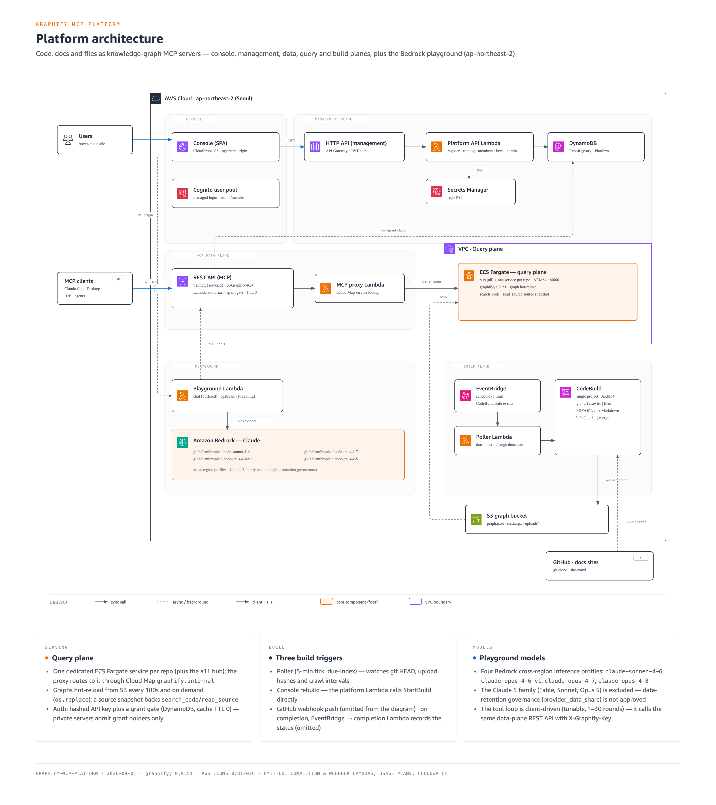
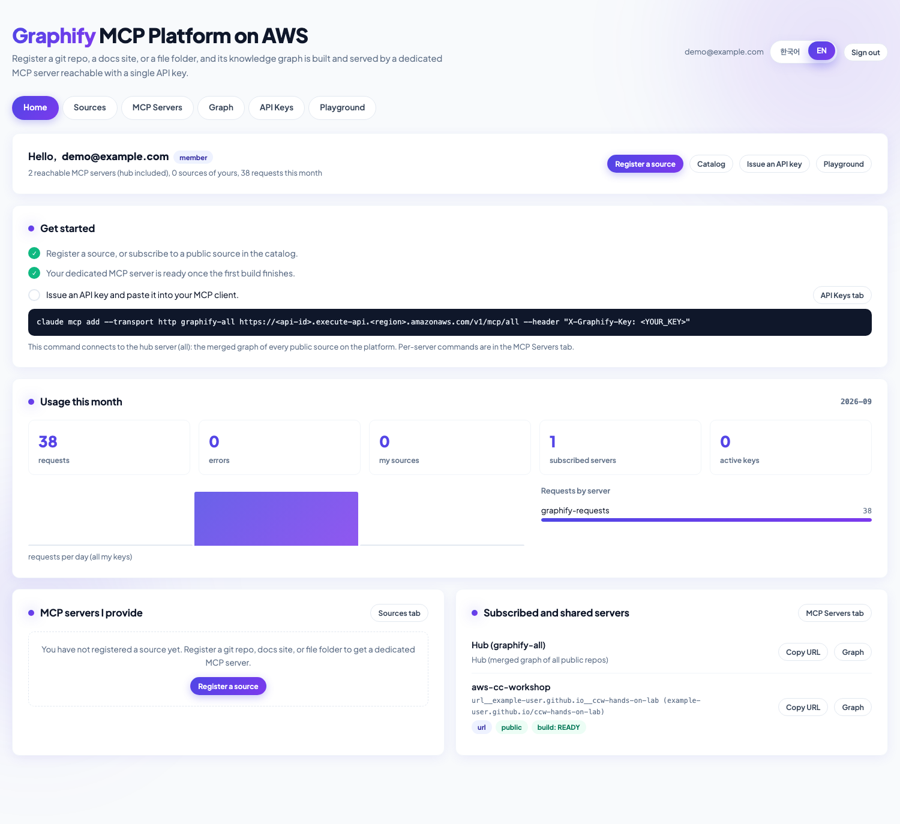
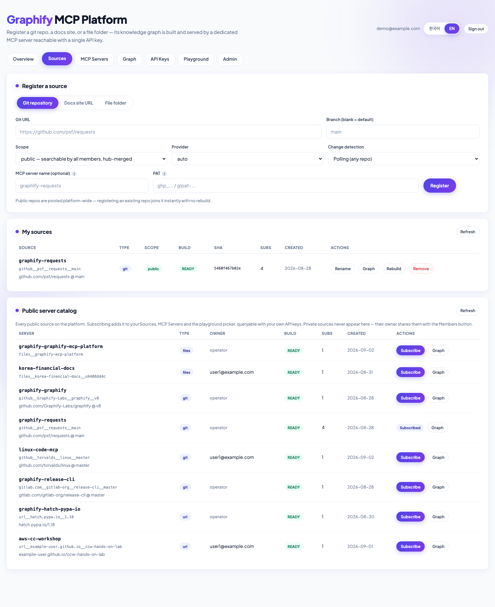
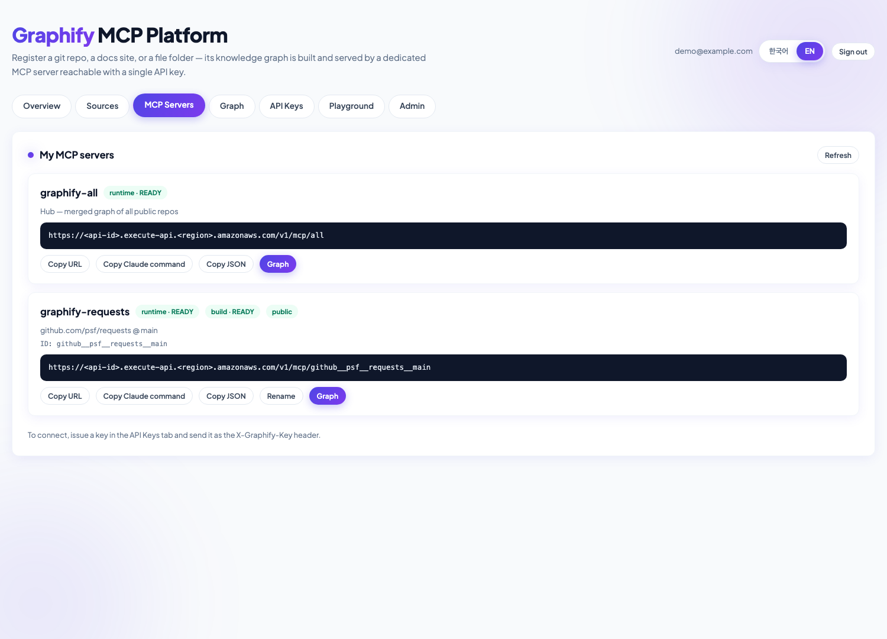
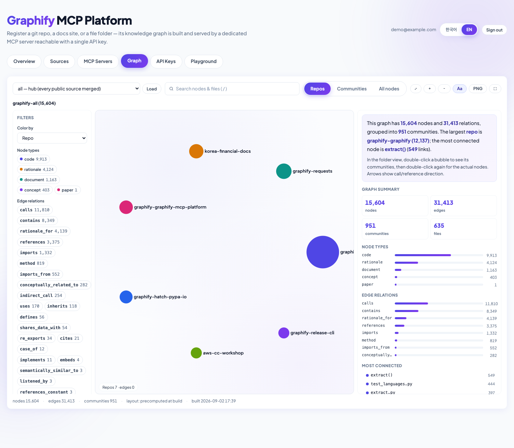
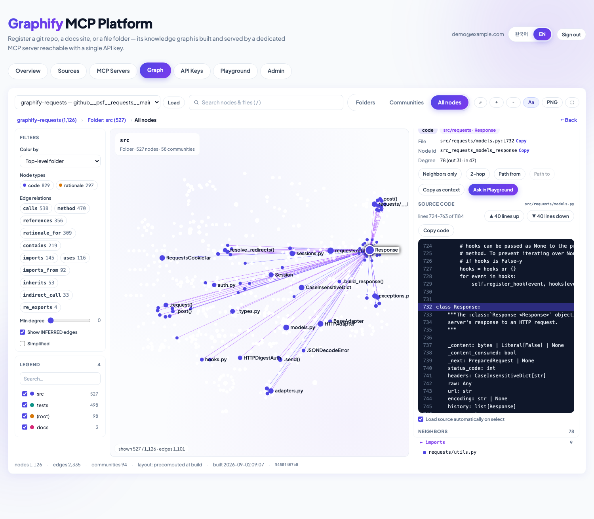
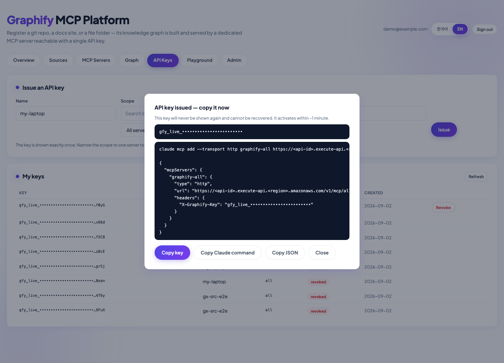
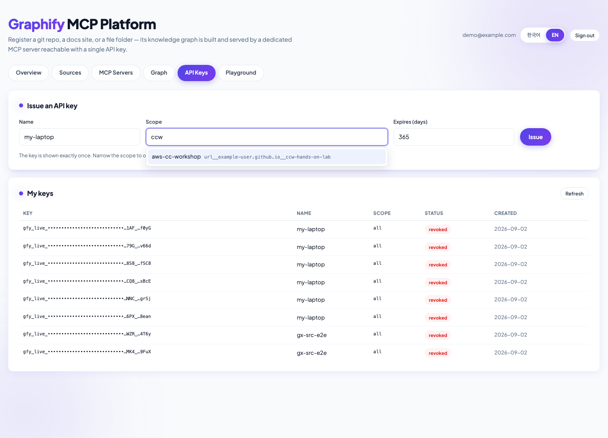
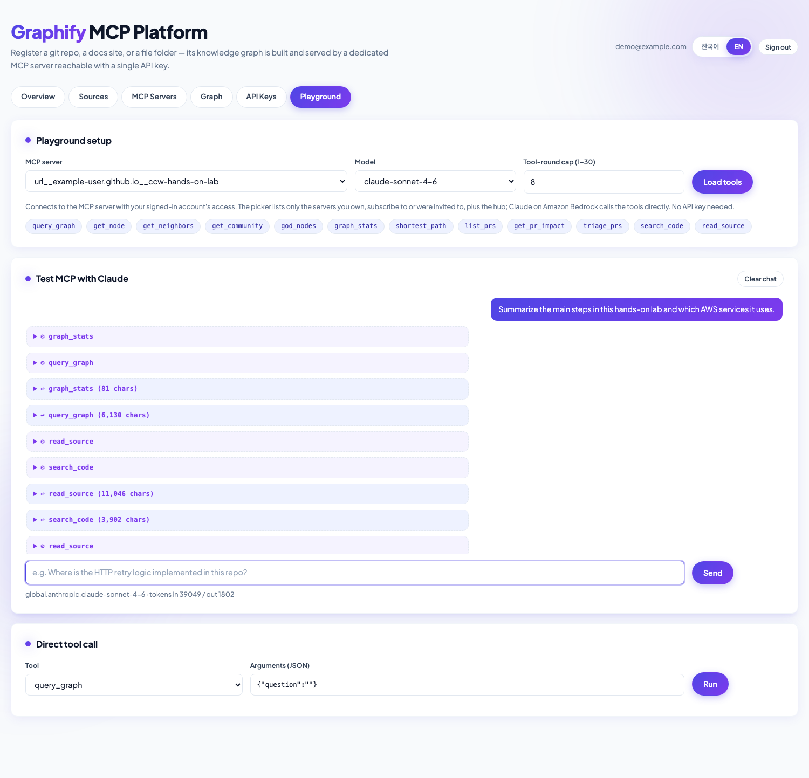
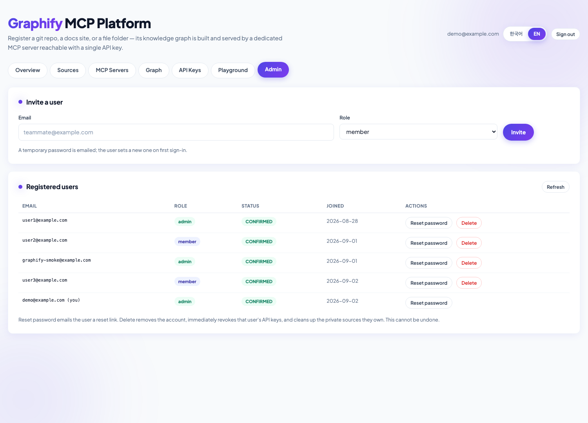

# Graphify MCP Platform on AWS

[**한국어 README**](README.ko.md) · [Engineering reference](docs/reference.md) · [Document sources ops](docs/document-sources-ops.md)

Turn any git repository, documentation site, or folder of files into a **knowledge-graph MCP server** that AI coding agents (Claude Code, Cursor, Kiro, Amazon Q Developer, …) can query — self-serve, multi-tenant, protected by API keys, and kept up to date automatically.

The sample wraps the open-source [graphify](https://github.com/Graphify-Labs/graphify) engine (AST + community detection → `graph.json`) in a fully AWS-native platform:


| Plane                    | What it does                                                                                                                                                         | Built on                                                    |
| ------------------------ | -------------------------------------------------------------------------------------------------------------------------------------------------------------------- | ----------------------------------------------------------- |
| **Build**                | Detects changes (polling, webhooks, S3 uploads, site re-crawls), rebuilds the graph incrementally at a pinned commit, publishes graph + viz bundle + source snapshot | EventBridge, Lambda, CodeBuild (ARM64), S3                  |
| **Query**                | One always-warm MCP server per source plus a **hub** that serves the merged graph of every public source; graphs hot-reload into live sessions without a redeploy    | ECS Fargate (Graviton), Cloud Map, VPC                      |
| **Data**                 | `POST /v1/mcp/{serverId}` with an `X-Graphify-Key` header — no AWS credentials or SigV4 on the client side; per-key scope, throttling, quota and metering            | API Gateway REST, Lambda authorizer, Lambda proxy, DynamoDB |
| **Management + console** | Invite-only web console: register sources, browse the public catalog, issue/revoke keys, explore graphs visually, test with Claude, administer users                 | CloudFront, S3, Cognito, API Gateway HTTP API, Lambda       |
| **Playground**           | Chat with Claude on **Amazon Bedrock** while it calls the MCP tools of a server your account may reach; streaming, Markdown, direct tool calls                       | Lambda (buffered + response streaming), Bedrock             |


> **Who is this for?** Solutions Architects and platform teams who want a reference implementation of *hosting remote MCP servers on AWS* — tenancy, key-based auth, warm compute, change-driven rebuilds, and a Bedrock-backed test harness — with graphify as a concrete, useful workload. Everything here is sample code: read [Security considerations](#security-considerations) before running it for real users.

---

## Table of contents

1. [Architecture](#architecture)
2. [Features and console tour](#features-and-console-tour)
3. [Prerequisites](#prerequisites)
4. [Deploy](#deploy)
5. [Connect an MCP client](#connect-an-mcp-client)
6. [Configuration](#configuration)
7. [Cost](#cost)
8. [Limits and quotas](#limits-and-quotas)
9. [Security considerations](#security-considerations)
10. [Operations](#operations)
11. [Repository layout](#repository-layout)
12. [Clean up](#clean-up)

---

## Architecture



*(Interactive version: [`docs/architecture.en.html`](docs/architecture.en.html); Korean: [`docs/architecture.ko.png`](docs/architecture.ko.png))*

### Request flows

**Build (change → graph).** EventBridge fires the poller Lambda every 5 minutes. For each due source it compares the current head (GitHub commits API with ETag, or the git smart-HTTP ref advertisement for any other host, or the S3 listing hash for file folders, or the crawl schedule for docs sites) with the last built revision. On change it claims the build with a conditional DynamoDB update and starts a CodeBuild job that fetches the exact commit (or the uploaded folder / crawled pages), converts PDF, Word and Excel files to Markdown (`convert_docs.py`; PDFs become section-aligned parts), runs `graphify extract` incrementally — or, when AI extraction is on, a Bedrock Claude semantic pass over the documents and their images — generates community labels and the explorer's layout bundle (`make_viz.py`), and publishes to `s3://<bucket>/repos/<repo_id>/latest/`. A completion Lambda records the result; the merged hub graph (`repos/__all__`) is refreshed on every build.

**Serve (S3 → live MCP).** Each Fargate task runs `runtime/entrypoint.py`: a sync thread watches the S3 ETag and atomically swaps `graph.json` with `os.replace()`; graphify reloads the graph on the next tool call, so updates propagate into live sessions within about three minutes. The task also unpacks a source snapshot so two platform tools — `search_code` and `read_source` — can ground graph answers in real code. Tasks live in a VPC and accept traffic **only** from the proxy Lambda's security group.

**Query (client → tool result).** An MCP client calls `POST /v1/mcp/{serverId}` with `X-Graphify-Key`. The REQUEST authorizer (TTL 0, so revocation is immediate) hashes the key, loads its scope from DynamoDB and returns a scoped IAM policy plus the API Gateway usage-plan identifier; the in-VPC proxy Lambda resolves the target task through Cloud Map DNS, forwards the JSON-RPC body to `:8000/mcp`, re-checks scope in code and increments per-key/per-server usage counters.

**Console.** The SPA (S3 + CloudFront) signs users in with Cognito managed login (PKCE) and calls the HTTP API with a JWT. Graph explorer bundles are served through short-lived presigned S3 URLs; the Playground calls Bedrock from Lambda and runs MCP tools through the in-VPC proxy under the signed-in user's own access (hub for everyone, other servers only with a grant) — no API key involved.

### Tenancy model

- **Public sources are pooled** — one build, one graph, one Fargate service shared by every member; a second registration just subscribes (reference-counted; torn down at zero).
- **Private sources are siloed** — the `repo_id` carries an owner suffix, the graph is kept out of the hub, and only the owner's grants/keys can reach the server. Private git repos use a PAT stored in Secrets Manager and resolved inside CodeBuild only.
- **API keys** are scoped to *all servers* or to an explicit list; the hub (`all`) only ever contains public graphs.

---

## Features and console tour

### Home — a role-aware dashboard

Your usage this month (per day and per server), the MCP servers you provide and the ones you subscribe to, an adaptive get-started checklist, and alerts for failed builds or expiring keys. Admins also get a platform-status panel (users, public sources, subscriptions, failed builds).



### Sources — register, subscribe, and the public catalog

Register a **git repository** (any smart-HTTP host: GitHub, GitLab, Bitbucket, Gitea, GitHub Enterprise…), a **docs-site URL** (sitemap-first crawler, robots.txt honored), or a **file folder** (an S3 upload prefix you `aws s3 sync` into; PDF/Word/Excel are converted to Markdown at build time). Choose public (pooled, hub-merged) or private (siloed). The **public server catalog** shows every public source on the platform with its type, owner, build status and subscriber count — subscribe with one click. Each source row carries its build settings: rebuild, rename, members (private), crawl settings (docs sites), file upload panel (file folders), and the **AI extraction settings** panel — Bedrock model, embedded-image extraction, corpus cap. Every table in the console is paginated.



### MCP servers — per-source endpoints ready to paste

Every subscribed source gets a dedicated MCP URL; `graphify-all` is the hub. Each card is titled by its MCP server name (the name `claude mcp add` registers) and shows two status pills — the query **runtime** (the Fargate service) and the latest **build** — with hover explanations. Copy the URL, a ready-made `claude mcp add` command, or the `.mcp.json` block, or rename the server in place.



### Graph explorer — understand a codebase visually

Nothing is laid out in the browser: every build precomputes a two-level layout (community meta-graph → members inside discs) and publishes a compact columnar bundle (~30× smaller than `graph.json`). Drill from **folders/repos → communities → nodes**, color by folder/type/community/repo, filter by node and edge type, search, find shortest paths, inspect a node's neighbors grouped by relation, read the **source code around the node inline**, copy a Markdown context block, or hand the node to the Playground. The hub view shows how repositories relate to each other.






### API keys — issue, scope, revoke

Keys are shown once, scoped to all servers or one server, expire after a configurable number of days and can be revoked instantly (the authorizer caches nothing).






### Playground — test MCP with Claude on Amazon Bedrock

Pick one of the servers your account can reach (the hub, plus sources you own, subscribe to or were invited to), load its tools and chat — no API key to paste. Claude (Sonnet 4.6 / Opus 4.6–4.8 via global cross-region inference profiles) calls the graph tools in an agentic loop that is **client-driven** — one model call per HTTP request — so no request outlives the platform limits. Output streams token-by-token over a Lambda Function URL; a direct tool-call panel lets you invoke a single tool with JSON arguments for protocol-level debugging.



### Admin — invite-only user management

Admins invite users (temporary password by email), reset passwords and delete accounts (which also revokes the user's keys and cleans up their private sources).



### MCP tools exposed to clients


| Tool                                                                                                     | Source        | What it does                                                                                                        |
| -------------------------------------------------------------------------------------------------------- | ------------- | ------------------------------------------------------------------------------------------------------------------- |
| `query_graph`, `get_node`, `get_neighbors`, `get_community`, `god_nodes`, `graph_stats`, `shortest_path` | graphify      | Semantic search over the graph, node/edge lookups, community summaries, hub nodes, statistics, path finding         |
| `search_code`                                                                                            | this platform | Full-text search over the source snapshot (literal or regex; per-repo servers only)                                 |
| `read_source`                                                                                            | this platform | Read a numbered line range of a file, grounded by a node's `source_file`/`source_location`                          |
| `list_prs`, `get_pr_impact`, `triage_prs`                                                                | graphify      | Listed for completeness; they need the `gh` CLI and a checkout, so they return tool-level errors in this deployment |


---

## Prerequisites

- An AWS account with administrator-level credentials and the [CDK bootstrapped](https://docs.aws.amazon.com/cdk/v2/guide/bootstrapping.html) in the target region (default `ap-northeast-2`).
- **Amazon Bedrock model access** enabled for Anthropic Claude models in that account (the Playground uses `global.*` cross-region inference profiles). The rest of the platform works without it.
- Local tooling: Python ≥ 3.12 with [`uv`](https://docs.astral.sh/uv/), Node.js 20+ (runs the CDK CLI via `npx`), and **Docker** (the deploy builds and pushes a `linux/arm64` image — on an x86 host Docker Desktop's QEMU emulation is used automatically).
- Optional but recommended: a GitHub personal access token in Secrets Manager for polling (see [Configuration](#configuration)); unauthenticated GitHub API calls share a 60 requests/hour budget per egress IP.

## Deploy

```bash
git clone https://github.com/aws-samples/aws-graphify-mcp-platform.git
cd aws-graphify-mcp-platform
uv sync                                          # Python deps for the CDK app and scripts
(cd lambdas/playground_stream && npm ci)         # Node deps for the streaming Lambda (shipped in the asset)

npx -y aws-cdk@2.1139.0 bootstrap                  # once per account/region
npx -y aws-cdk@2.1139.0 deploy                     # ~10 min; builds + pushes the query-plane image
```

The stack (`GraphifyMcpPlatform` by default; override with `-c stack_name=...` or `GRAPHIFY_STACK_NAME`, which the operator scripts read too) prints its outputs — keep `ConsoleUrl`, `McpDataApiUrl` and `PlatformApiUrl` handy.

Create the first administrator and sign in:

```bash
uv run python scripts/create_platform_user.py --email you@example.com --admin
# prints a one-time password and the console URL
```

Everything else can be done in the console: register a source (a public GitHub repo such as `https://github.com/psf/requests` takes 1–2 minutes to build), watch it reach **READY**, issue an API key, and connect a client. The same flow is scriptable:

```bash
uv run python scripts/register_repo.py --url https://github.com/psf/requests   # public repo, default branch auto-resolved
GRAPHIFY_API_KEY=gfy_live_... uv run python scripts/smoke_test.py --repo-id github__psf__requests__main --node Session
uv run python scripts/print_mcp_config.py                                     # emits the .mcp.json block
```

## Connect an MCP client

```bash
# Claude Code — the hub searches every public source at once
claude mcp add --transport http graphify-all \
  https://<api-id>.execute-api.<region>.amazonaws.com/v1/mcp/all \
  --header "X-Graphify-Key: gfy_live_..."

# or a single source
claude mcp add --transport http graphify-requests \
  https://<api-id>.execute-api.<region>.amazonaws.com/v1/mcp/github__psf__requests__main \
  --header "X-Graphify-Key: gfy_live_..."
```

Any client that speaks MCP **streamable HTTP** with a custom header works (Cursor, Kiro, Amazon Q Developer CLI, the MCP Inspector). Keys become active about a minute after issuance (API Gateway usage-plan propagation).

**Claude Code shows "Needs authentication".** This API authenticates with the static `X-Graphify-Key` header and has no OAuth. Claude Code marks a server as needing authentication the first time a request returns 401/403 — a wrong or placeholder key, a key scoped to a different server (a source-scoped key gets 403 on `all` and on other sources), or a key issued seconds ago — and then **skips connecting** until that cache is cleared, even after you fix the key. To recover: fix the key (`claude mcp remove <name>` then `claude mcp add … --header "X-Graphify-Key: gfy_live_…"`), then clear the cache with `/mcp` → the server → *Clear authentication* (or delete its entry from `~/.claude/mcp-needs-auth-cache.json`) and reconnect. Check the server itself with `curl -s -X POST -H "X-Graphify-Key: …" -H "Content-Type: application/json" -d '{"jsonrpc":"2.0","id":1,"method":"tools/list"}' <url>` — 200 means the key and scope are right; the 401/403 bodies carry a `hint`. The endpoint answers GET/DELETE with a spec-legal 405 and undefined routes with 404, so a healthy client never sees a 403 during the handshake.

Then ask your agent things like *"Which modules does `Session` depend on, and who calls `merge_environment_settings`?"* — the graph answers structure questions that grep cannot, and `read_source` lets the agent verify before it answers.

## Configuration

Pass CDK context flags at deploy time (`-c key=value`):


| Flag                      | Default               | Purpose                                                                                                                                                                 |
| ------------------------- | --------------------- | ----------------------------------------------------------------------------------------------------------------------------------------------------------------------- |
| `stack_name`              | `GraphifyMcpPlatform` | CloudFormation stack name (the `GRAPHIFY_STACK_NAME` env var works too and is also read by the operator scripts)                                                        |
| `runtime_name`            | `graphify_mcp`        | Naming stem for the CodeBuild project, log groups and services (`[a-zA-Z][a-zA-Z0-9_]{0,47}`, **no hyphens**)                                                           |
| `github_token_secret_arn` | —                     | Secrets Manager secret holding a GitHub PAT for polling; strongly recommended beyond light testing                                                                      |
| `build_compute`           | `large`               | CodeBuild size for graph builds: `small` (2 vCPU/4 GB, free-tier eligible), `medium` (4/8), `large` (8/16). Large repos need `large` to avoid OOM during graph assembly |
| `hub_cpu` / `hub_memory`  | `2048` / `4096`       | Fargate size of the hub task (Fargate CPU/memory units)                                                                                                                 |
| `nag`                     | off                   | `-c nag=true` runs [cdk-nag](https://github.com/cdklabs/cdk-nag) AwsSolutions checks during `cdk synth`                                                                 |


Per-source settings live on the registry row and are set at registration or in the console: poll interval, webhook vs polling, public/private scope, per-repo task size (`service_cpu`/`service_memory`, default 0.5 vCPU / 2 GB — bump for very large graphs), prune paths, and — for document sources (docs-site URLs and file folders) — LLM-assisted extraction (`llm_extract`, uses Bedrock at build time) with its model (`llm_model`, an allow-listed Bedrock inference profile — Sonnet 5 default, Opus 5, Sonnet 4.6, Opus 4.8, Haiku 4.5), raster images through Claude vision (`llm_images`, file sources only), and the Markdown size above which a build falls back to the quick-scan (`llm_corpus_cap_mb`, default 64 MB, max 512). All of these are set at registration or later from the source's **AI extraction settings** panel; saving starts a rebuild, and enabling extraction gives the source a 120-minute build timeout when it has none.

## Cost

Estimates use **public on-demand prices for `ap-northeast-2` (Seoul)** as of September 2026, 730 hours/month, and exclude free tiers and taxes. Verify with the [AWS Pricing Calculator](https://calculator.aws/) for your region and usage.

The always-on query plane dominates. Everything else is request-priced and stays in the low single digits of dollars at sample scale.


| Component                                                                   | Sizing                                                  | Approx. monthly                                                                              |
| --------------------------------------------------------------------------- | ------------------------------------------------------- | -------------------------------------------------------------------------------------------- |
| **Hub Fargate task** (Graviton, always on)                                  | 2 vCPU / 4 GB (default)                                 | ≈ $66 (≈$39 with `-c hub_cpu=1024`)                                                          |
| **Per-source Fargate task** (Graviton, always on)                           | 0.5 vCPU / 2 GB (default)                               | ≈ $20 **per source**                                                                         |
| Public IPv4 address per task (tasks sit in public subnets, no NAT gateway)  | $0.005/h                                                | ≈ $3.65 per task                                                                             |
| Cloud Map private DNS namespace                                             | 1 hosted zone                                           | ≈ $0.50                                                                                      |
| Secrets Manager                                                             | webhook HMAC secret (+ one per private-repo PAT)        | $0.40 per secret                                                                             |
| CodeBuild (ARM)                                                             | `large` ≈ $0.015/min; typical build 1–4 min; LLM document builds 20–150 min | ≈ $0.05 per typical build, ≈ $0.3–2.3 of CodeBuild time per LLM document build (`small` has 100 free min/month)                                           |
| API Gateway, Lambda, DynamoDB (on-demand), S3, EventBridge, CloudWatch Logs | request-priced                                          | ≈ $1–3                                                                                       |
| CloudFront (console + streaming origin), Cognito                            | free tier covers sample usage                           | ≈ $0                                                                                         |
| **Bedrock (Playground + `llm_extract` builds)**                             | Claude Sonnet 4.6 / Sonnet 5, $3 /$15 per 1M input / output tokens | ≈ $0.15–0.25 per agentic turn (a tool-calling turn observed at 46k input / 3k output tokens); LLM builds: 24 regulatory PDFs ≈ $4.6, a 168-PDF / 13 MB-Markdown corpus ≈ $60 per cold build (cached re-builds pay only for changed documents) |


**Example: hub + 3 sources** ≈ $66 + 3 × $20 + 4 × $3.65 + ≈ $3 ≈ **$145/month**, plus Playground usage. A minimal deploy with the hub only is ≈ $70/month.

Ways to reduce cost: `-c hub_cpu=1024 -c hub_memory=2048` (≈ $33 hub), deregister sources you are not using (`scripts/deregister_repo.py` deletes the service), `-c build_compute=small` for small repos, and `cdk destroy` when idle — every graph is rebuilt from the registry on re-registration.

## Limits and quotas

Limits enforced by this sample (all adjustable in code):


| Area                    | Limit                                                                                                                                                                                                                                                                                                                                                                                                                                                                                                                       |
| ----------------------- | --------------------------------------------------------------------------------------------------------------------------------------------------------------------------------------------------------------------------------------------------------------------------------------------------------------------------------------------------------------------------------------------------------------------------------------------------------------------------------------------------------------------------- |
| **Data plane**          | Per API key: 20 requests/s, burst 40, **500,000 requests/month** (API Gateway usage plan). Stage-wide: 100 rps / 200 burst. Authorizer cache TTL 0 (revocation is immediate). Proxy Lambda timeout 60 s; the REST integration ceiling is 29 s per call                                                                                                                                                                                                                                                                      |
| **API keys**            | At most **10 active keys per user** (an 11th mint returns 409; revoked or expired keys free their slot). Format `gfy_live_<kid>_<secret><crc>`; expiry 1–730 days (default 365); shown once                                                                                                                                                                                                                                                                                                                                                                                                                                                 |
| **Graph serving cap**   | The MCP server (graphify) refuses to load a `graph.json` above **512 MiB**, and the hub merge skips such graphs. A build that produces one is marked **`TOO_LARGE`** instead of `READY` (red pill in the console, `last_error` explains); the source keeps its explorer bundle but its tool calls fail until the graph is shrunk (`prune_paths`, splitting the source). Below the cap, resident memory is roughly 7× file size, so size `service_memory` accordingly (defaults 0.5 vCPU / 2 GB; tiers up to 4 vCPU / 30 GB) |
| **Source snapshot cap** | The build uploads the checkout as `src.tar.gz` only when it is ≤ **200 MB** compressed; larger sources get a graph but no `search_code`/`read_source` and no inline source viewer (the console shows a `no source` badge, `has_snapshot: false` in the API). Inside a snapshot, files &gt; 20 MB are skipped and extraction stops at 400 MB uncompressed                                                                                                                                                                    |
| **Builds** | CodeBuild `large` (8 vCPU / 16 GB ARM) by default, **60 min timeout**. Both are overridable per source on the registry row: `build_timeout_minutes` (CodeBuild's 5–480 range; set to 120 automatically when LLM extraction is enabled on a source without one) and `build_compute` (CodeBuild's own enum, `BUILD_GENERAL1_SMALL\|MEDIUM\|LARGE`, unlike the `small\|medium\|large` deploy-time flag). The poller, the console rebuild and `scripts/update_repo_runtimes.py --rebuild` all forward them. Build history kept 30 days in `history/`; poller every 5 min; webhook repos keep a 6 h safety poll |
| **Docs-site sources** | 200 pages per crawl by default, ≤ 500 (`max_pages`); 5 MB per page, 10 MB per sitemap, ≤ 3 redirects; same host + path prefix only, robots.txt honored, private/link-local targets refused, re-crawl every 6 h by default |
| **File sources** | Upload: **100 MB per file** (presigned POST), ≤ 200 files per presign/delete request, console lists up to 2,000 objects. Build: a folder is fetched only when it holds ≤ **20,000 files and ≤ 1 GB** in total (otherwise the build fails with a log line). PDF/DOCX/XLSX are converted at build time — a PDF becomes a folder of section-aligned Markdown parts (`<name>.pdf.d/001-<title>.md`, split at headings detected from bookmarks, bold/larger fonts and 제N장/N.N numbering; each page keeps a `p.N` marker), stops at 2,000 pages, and each part is truncated at 10 MB; image-only PDFs are skipped. Change detection hashes the upload prefix listing; files are materialized under NFC names (keys synced from macOS arrive NFD, and the LLM cites paths in NFC). **Prefer source Markdown/HTML trees over a rendered PDF when you have them**: PDF text loses styling and tables, and headings are recovered heuristically (a 590-page guide extracted to 409 nodes as one un-split PDF, versus 707 as 168 Markdown pages plus images). Enabling `llm_extract` sets `build_timeout_minutes` to 120 when the source has none |
| **LLM-assisted extraction** | `llm_extract` runs only while the converted Markdown corpus is under the source's **corpus cap** (`llm_corpus_cap_mb`, default **64 MB** ≈ 16M input tokens, max 512, set in the AI extraction panel); above it the build deterministically falls back to the quick-scan (`LLM extract skipped … cap` in the log) so token spend stays bounded. Extraction runs 6 Bedrock workers and checkpoints the semantic cache to S3 every 10 minutes, so a build that hits its timeout resumes from where it stopped. Completed chunks are cached in S3 (`llmcache`), so retries and re-syncs only pay for what changed. Long documents are split recursively when Claude's output is truncated, which is what makes these builds slow: budget **roughly 1 hour cold per 4 MB corpus** and set `build_timeout_minutes` ≥ 90 for such sources. Chunks are packed to **30k input tokens** (`--token-budget`, half of graphify's default) and output is capped at **64k tokens per call** (`GRAPHIFY_MAX_OUTPUT_TOKENS`, up from graphify's 16k default; every allow-listed model accepts it) with a 1,500 s Bedrock read timeout — together they keep dense text from hitting the cap and triggering graphify's bisect-and-keep-partial fallback. `llm_images` (file sources) sends png/jpg/gif/webp through the vision path — ≈ 1.6k tokens per image, 5 MB per image, 20 per request, and above **600 images** the build extracts text only. Figures embedded in PDFs are pulled out as well: unique by content, ≥ 20 KB and ≥ 200 px, largest first, a hard **300 across the corpus** shared by page count, downscaled to 1,280 px, never copied into the source snapshot. `llm_model` picks the Bedrock model; the S3 semantic cache is namespaced per model, so the first build after switching pays full price |
| **Platform tools**      | `search_code`: 1 MB scan cap per file, 5 s budget, 100 results; `read_source`: ≤ 400 lines per call                                                                                                                                                                                                                                                                                                                                                                                                                         |
| **Graph explorer**      | 500 presigned bundle URLs per user per day (300 s TTL); 3,000 inline source reads per user per day; raw-graph fallback up to 32 MB; explorer layout skipped above 12,000 communities                                                                                                                                                                                                                                                                                                                                        |
| **Playground**          | 20,000,000 Bedrock tokens per user per day (resets 00:00 UTC); ≤ 60 messages per conversation, ≤ 48 tools, ≤ 4,096 output tokens per call, tool results truncated at 16,000 chars, 1–30 tool rounds per turn (default 8); route throttles 5 rps for chat, 20 rps for the MCP bridge; streaming Lambda reserved concurrency 20                                                                                                                                                                                                |
| **Console API**         | Cognito is invite-only (no self sign-up); graph routes throttled at 5 rps                                                                                                                                                                                                                                                                                                                                                                                                                                                   |


### How big can a source be?

The hard ceiling is the **512 MiB `graph.json` serving cap**; everything else is a matter of build time and task memory. Data points from this deployment (CodeBuild `large`, `graphifyy` 0.9.51):

| Source | Build | Result |
| --- | --- | --- |
| `pallets/click` (typical library) | ≈ 1 min | 2 MB graph, default 0.5 vCPU / 2 GB task |
| `BerriAI/litellm` (≈ 1 M LOC monorepo) | a few minutes | 81 MB graph, needs a 1 vCPU / 4 GB task (~7× RSS rule) |
| 24 Korean regulatory PDFs, `llm_extract` | 52 min cold, 30 min warm cache | 1.6 MB semantic graph; timed out at the old 30 min cap |
| 590-page user guide as one 29 MB PDF, `llm_extract` | 18 min | only 409 nodes — sparse; re-uploaded as 168 Markdown pages instead |
| 168 Korean regulatory/cloud-security PDFs (493 MB, 7,759 pages), `llm_extract` + `llm_images` | ≈ 2 h 15 min (conversion ≈ 25 min, 127 Bedrock chunks on 6 workers, 1 truncation) | 4,301 nodes / 5,027 edges incl. 171 image nodes, 8.5 MB graph; ≈ $60 in Bedrock tokens cold (13 MB of Markdown) |
| Linux kernel, full tree | ≈ 110 min (240 min cap) | **1.6 GB graph → `TOO_LARGE`**, hub merge skipped it |

Rules of thumb: the default 2 GB task serves graphs up to roughly 250 MB; anything approaching the 512 MiB cap needs a 4–8 GB task. A monorepo that would exceed the cap must be registered with `prune_paths` (drop tests, vendored code, docs, whole subsystems) or split into several sources — there is no runtime setting that makes an oversize graph loadable.

AWS service quotas worth checking before scaling out: Fargate on-demand vCPU quota per region (each source adds a task), Cloud Map services per namespace, API Gateway account-level throttle, Lambda concurrent executions (the streaming Lambda reserves 20), Bedrock tokens-per-minute for the models you enable, and CodeBuild concurrent builds.

## Security considerations

This is sample code. The design keeps a small attack surface — nothing but API Gateway, CloudFront and Cognito is reachable from the internet; Fargate tasks admit only the proxy Lambda's security group; API keys are stored as SHA-256 hashes; PATs never leave Secrets Manager/CodeBuild; the webhook verifies `X-Hub-Signature-256` over the raw body; the console renders model output through DOMPurify — but before exposing it to real users review at least:

- **Trust boundary of the console.** Every signed-in member can see the public catalog (including owner e-mail addresses) and search other members when granting access. Treat the console as an internal tool for a team you trust, or tighten `search_users`/catalog fields.
- **cdk-nag findings.** `npx -y aws-cdk@2.1139.0 synth -c nag=true` reports the AwsSolutions rules this stack does not yet satisfy (S3 access logging, CloudFront/WAF/geo restrictions and TLS policy on the default certificate, Cognito MFA and advanced security, API Gateway access logs and request validation, VPC flow logs, ECS Container Insights, scoped-down IAM wildcards). Add these controls or documented suppressions for a production deployment.
- **Public subnets without NAT.** Tasks and the proxy Lambda run in public subnets with security-group isolation to keep idle cost near zero. Private subnets + NAT (or interface endpoints) are a straightforward change in `cdk/graphify_stack.py` if your policy requires it.
- **Base image vulnerabilities.** The query-plane image is Debian-based `python:3.12-slim` from ECR Public with `apt-get upgrade` at build time; remaining findings are unfixed upstream Debian CVEs (see `trivy image --ignore-unfixed`). Rebuild regularly (`cdk deploy` + `scripts/sync_runtimes.py`).
- **Bedrock data handling.** The Playground sends graph content and your prompts to Bedrock in your account; its model picker lists Sonnet 4.6 and Opus 4.6–4.8; add Claude 5 ids in `console/index.html` once your account's Bedrock data-retention mode allows them. LLM-assisted extraction (`llm_extract`) sends document text — and, with `llm_images`, images — to Bedrock at build time using the source's chosen model (Sonnet 5 by default); review your account's Bedrock data-retention posture before enabling it on sensitive corpora.

## Operations

There is no unit-test suite; the `scripts/*_smoke.py` scripts are end-to-end checks against the live stack:

```bash
uv run python scripts/platform_smoke.py --email <e> --password <p>   # Cognito → register → key → MCP call → negatives → usage
uv run python scripts/playground_smoke.py --email <e> --password <p> # tools/list → chat → tool-use loop → negatives
uv run python scripts/graph_smoke.py --email <e> --password <p>      # explorer API + presigned bundle (34 checks)
uv run python scripts/smoke_test.py --repo-id <id> --node <name>     # raw JSON-RPC through the data plane (GRAPHIFY_API_KEY)
```

Routine tasks:

- **Roll the query plane** after changing `runtime/` (`cdk deploy` publishes the image, then `uv run python scripts/sync_runtimes.py` restarts every per-source service).
- **Rebuild one source** (e.g. to generate its explorer bundle): `uv run python scripts/update_repo_runtimes.py --rebuild --repo-id <id>`.
- **Remove a source**: `uv run python scripts/deregister_repo.py --repo-id <id> [--purge]`.
- **Logs**: `/graphify/<runtime_name>/services` (every Fargate task, hub included) is created by the stack with **30-day retention**. The CodeBuild project's `/aws/codebuild/<runtime_name>_graph_build` group and each Lambda's `/aws/lambda/...` group are created by those services on first use and **never expire** — attach explicit `logs.LogGroup`s in `cdk/graphify_stack.py` (`log_group=` on the functions, `logging=` on `codebuild.Project`) if your policy needs them trimmed.
- **Security scans**: `npx -y aws-cdk@2.1139.0 synth -c nag=true -o /tmp/cdk.out.nag` writes the cdk-nag report; `trivy image` on the image built from `runtime/Dockerfile`, `npx retire` on `console/` plus the SRI-pinned CDN files, and `npm audit` in `lambdas/playground_stream/` cover the rest of the stack.

## Repository layout


| Path                 | What                                                                                                                                                                 |
| -------------------- | -------------------------------------------------------------------------------------------------------------------------------------------------------------------- |
| `cdk/`               | CDK app (Python): VPC + ECS Fargate query plane, S3, DynamoDB, CodeBuild + inline buildspec, Lambdas, API Gateways, Cognito, CloudFront                              |
| `cdk/build_scripts/` | Scripts shipped to CodeBuild: `make_viz.py` (layout bundle), `docs_crawler.py`, `convert_docs.py`, `fetch_uploads.py`, `docs_extract_driver.py` (quick-scan driver)  |
| `runtime/`           | Query-plane container: `Dockerfile` (linux/arm64) + `entrypoint.py` (S3 sync, hot-reload, `search_code`/`read_source`)                                               |
| `lambdas/`           | `poller`, `completion`, `webhook` (build plane) · `authorizer`, `mcp_proxy` (data plane) · `platform_api` (management) · `playground`, `playground_stream` (Bedrock) |
| `console/`           | Console SPA (`index.html`, `graph.js`, `graph.css`) deployed to S3 + CloudFront                                                                                      |
| `scripts/`           | Operator CLI: register/deregister sources, create users, sync runtimes, smoke tests, MCP config printer                                                              |
| `docs/`              | Architecture diagrams (ko/en), screenshots, [engineering reference](docs/reference.md), [document-source operations](docs/document-sources-ops.md)                   |
| `webapp/`            | Pre-Fargate localhost setup console — **stale**, kept for reference only                                                                                             |


## Clean up

```bash
# delete per-source Fargate services first (they are created outside CloudFormation)
uv run python scripts/deregister_repo.py --repo-id <id> --purge   # repeat per registered source
npx -y aws-cdk@2.1139.0 destroy
```

The graph bucket, the tables and the `/graphify/<runtime_name>/services` log group are created with `RemovalPolicy.DESTROY`, so `cdk destroy` removes them; the CodeBuild and Lambda log groups are service-created and must be deleted by hand, and the ECR image lives in the CDK bootstrap repository.

## Security

See [CONTRIBUTING](CONTRIBUTING.md#security-issue-notifications) for more information.

## License

This library is licensed under the MIT-0 License. See the [LICENSE](LICENSE) file.