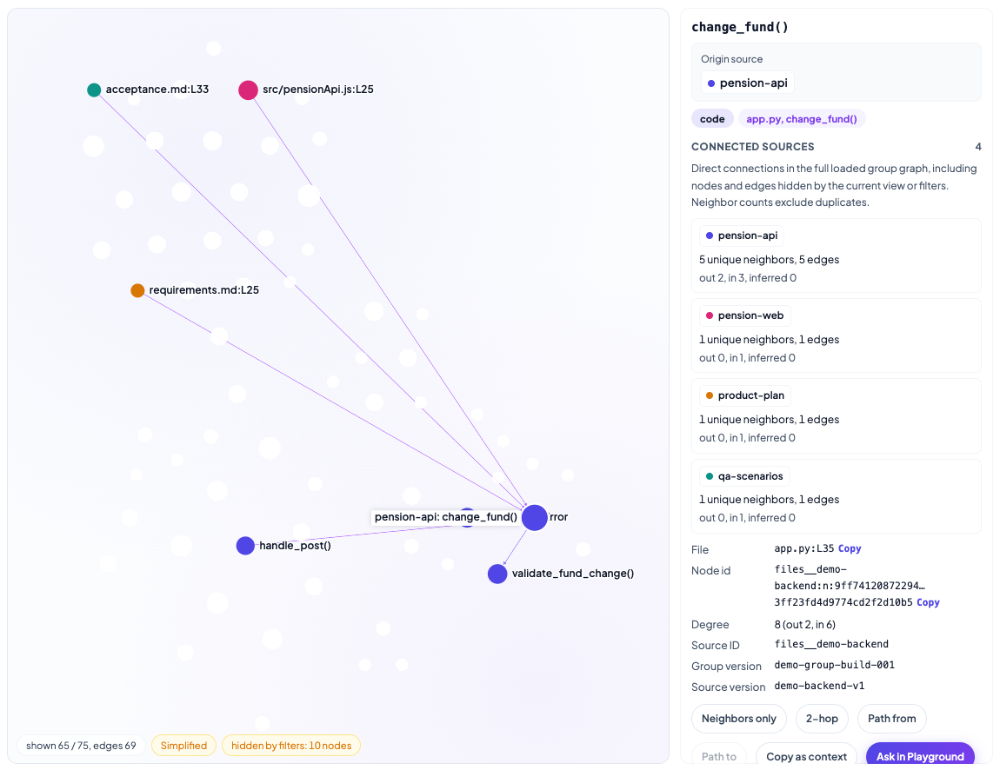
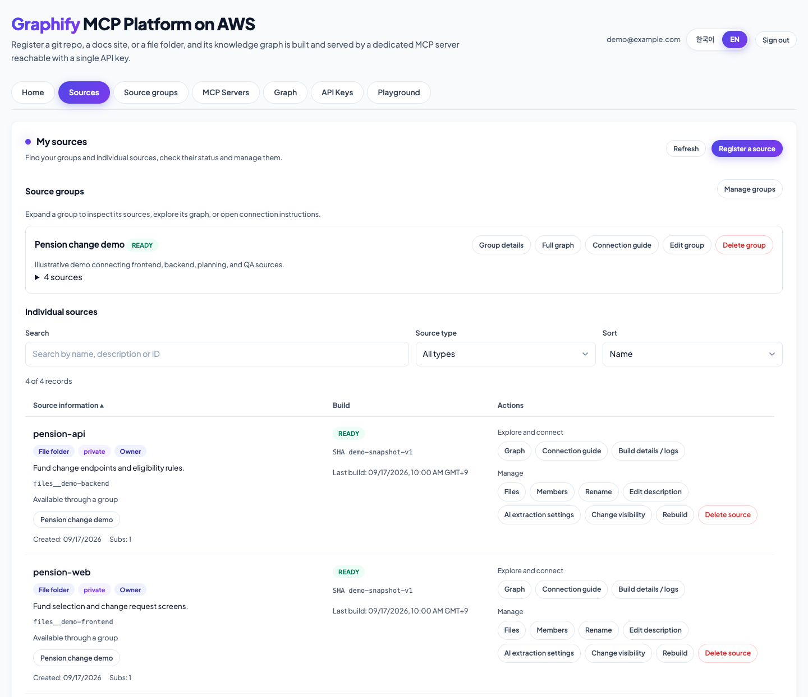
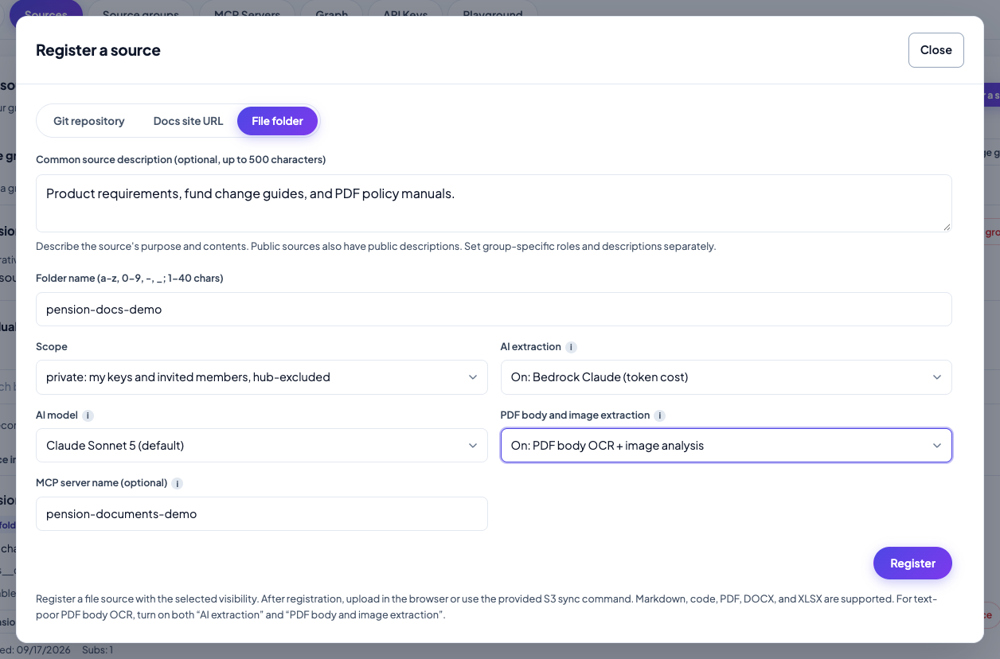
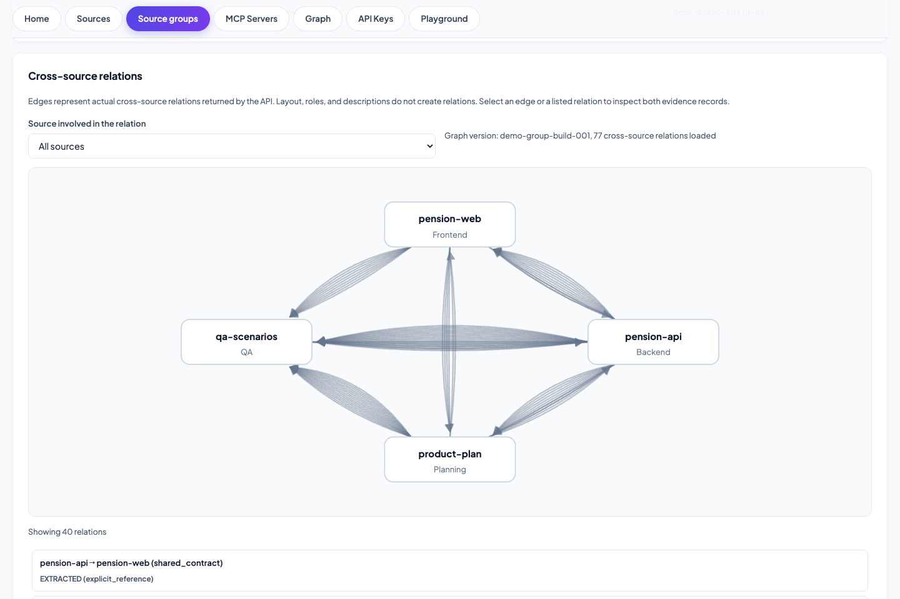
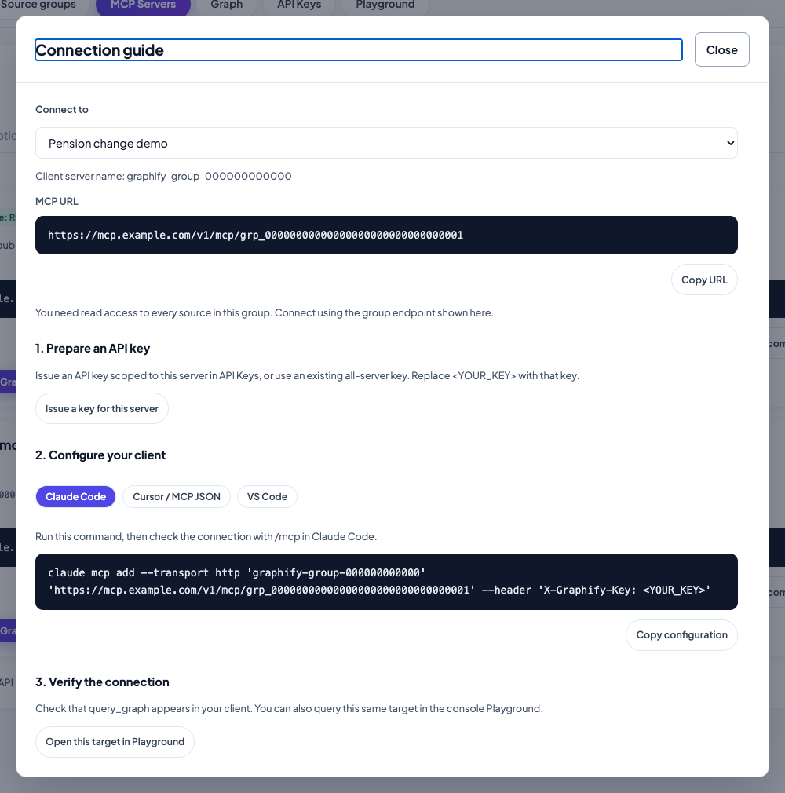
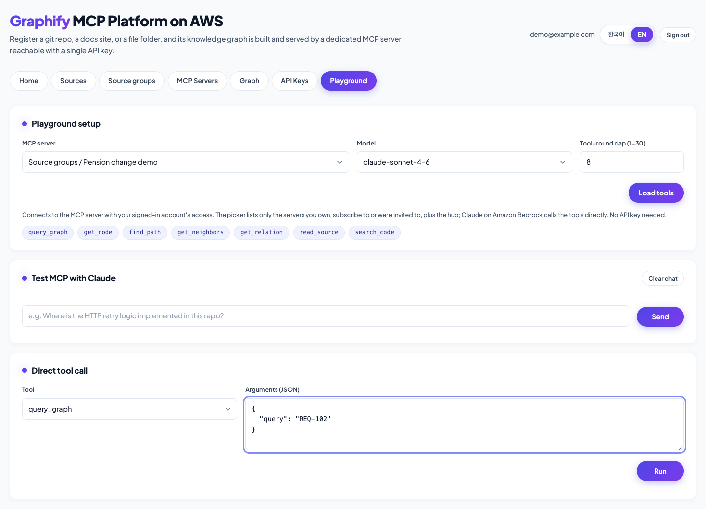
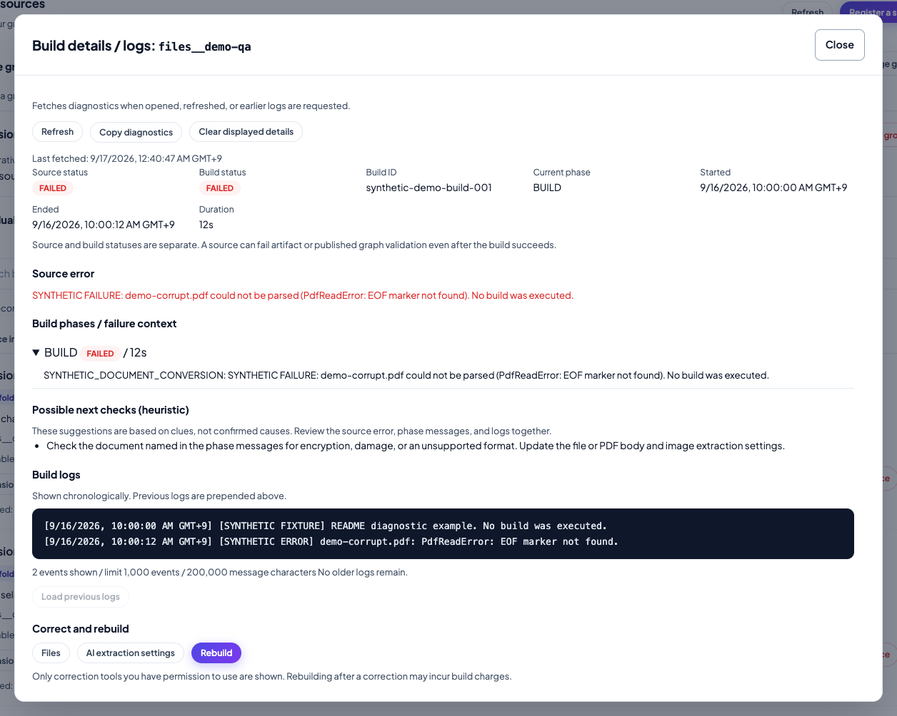
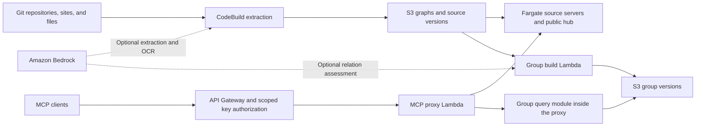

# Graphify MCP Platform on AWS

[한국어](README.ko.md) | [Source groups](docs/source-groups.md) | [Build diagnostics](docs/build-diagnostics.md) | [Engineering reference](docs/reference.md)

Host code and document knowledge graphs as remote MCP servers on AWS. Register sources in a web console, connect related sources into a project graph, and let AI assistants follow relationships and read the supporting source text.

The platform uses [graphify](https://github.com/Graphify-Labs/graphify) to build graphs. It adds source management, access control, versioned source groups, build diagnostics, a graph explorer, and a Claude Playground on Amazon Bedrock.

For example, a project can have separate sources for its frontend, backend, requirements, and QA documents. A source group lets you trace an API or requirement across those sources, inspect the recorded evidence, and give an AI coding assistant the same MCP endpoint.



This repository is an AWS sample. The guide covers deployment and day-to-day operation; review the [production deployment considerations](#production-deployment-considerations) before onboarding users or sensitive sources.

## Start here

| Your task | Where to start |
| --- | --- |
| Deploy a platform | [Deploy to AWS](#deploy-to-aws) |
| Add code or documents | [Register your first source](#register-your-first-source) |
| Connect repositories and project documents | [Create a source group](#create-a-source-group) |
| Configure an AI coding assistant | [Connect an MCP client](#connect-an-mcp-client) |
| Investigate a failed build | [Diagnose a failed build](#diagnose-a-failed-build) |
| Estimate spend or maintain a deployment | [Cost planning](#cost-planning) and [Operations](#operations) |

Screenshots use the current console with demo data and replayed API responses. They illustrate the interface, not benchmark results. Endpoints and identities are examples. See [screenshot details and reproduction](docs/screenshots/README.md).

## Sources, groups, and the public hub

| Concept | Contents | Access and serving |
| --- | --- | --- |
| **Source** | One Git repository, documentation site, or uploaded folder | Public or private. Ordinary sources have a dedicated Fargate MCP service. |
| **Source group** | Up to eight existing sources, their pinned versions, and recorded cross-source relations | Private. Each reader needs group access and access to every member source. Queries run on demand in Lambda. |
| **Public hub** (`all`) | Merged graphs from public sources | Available to signed-in platform members and appropriately scoped API keys. Private sources and private groups are excluded. |

Here, **public** means shared within the platform. It does not mean anonymous internet access. Registering an existing public source subscribes to the shared source instead of creating another copy.

A graph link records a relationship. It does not by itself prove that an implementation satisfies a requirement or that a test covers it. Use the linked source text to check the conclusion.

## Deploy to AWS

### Prerequisites

- An AWS account and a deployment role allowed to create the resources in the [architecture](#architecture), including IAM roles.
- AWS CLI v2 with working credentials for the target account.
- Python 3.12 or later and [uv](https://docs.astral.sh/uv/).
- Node.js 22 or later, following the [AWS CDK prerequisites](https://docs.aws.amazon.com/cdk/v2/guide/prerequisites.html).
- A running Docker engine that can build `linux/arm64` images. On an x86 host, configure ARM emulation.
- Access to the selected Amazon Bedrock models if you will use document AI extraction, PDF OCR, AI relation assessment, or Playground chat. Model availability and invocation permissions depend on the account and region.

### 1. Prepare the checkout and deployment environment

```bash
git clone https://github.com/aws-samples/sample-graphify-mcp-platform-on-aws.git
cd sample-graphify-mcp-platform-on-aws

uv sync
npm ci --prefix lambdas/playground_stream

export AWS_REGION=ap-northeast-2
export AWS_DEFAULT_REGION="$AWS_REGION"
export GRAPHIFY_STACK_NAME=GraphifyMcpPlatform

aws sts get-caller-identity
```

Check the account returned by the last command. If you use a named AWS profile, set `AWS_PROFILE` before running these commands.

For an existing deployment, use its original region and stack name. A different stack name creates a separate stack; it does not upgrade the original deployment.

### 2. Bootstrap and deploy

```bash
# Bootstrap the target account and region once.
npx -y aws-cdk@2.1139.0 bootstrap

# Build the ARM runtime image and deploy the stack.
npx -y aws-cdk@2.1139.0 deploy
```

The stack outputs include:

| Output | Use |
| --- | --- |
| `ConsoleUrl` | Open the web console. |
| `McpDataApiUrl` | Base URL for API-key-authenticated MCP requests. |
| `PlatformApiUrl` | Management API used by the console. |

Deployment time depends on Docker image builds and AWS resource provisioning. Keep the same `GRAPHIFY_STACK_NAME` environment variable for the operator scripts below.

### 3. Create the first administrator

```bash
uv run python scripts/create_platform_user.py --region "$AWS_REGION" --email admin@example.com --admin
```

Run this in a private terminal. The script prints a permanent password and the console URL; it does not send an email. Open the console and sign in with that account.

The user pool has no self-registration. Administrators invite subsequent users from **Admin**. Running the bootstrap script again for an existing email resets that account's password. Operator scripts default independently to Seoul, so pass `--region` when using another region.

The **Admin** page also supports password resets and account removal. Removing a user revokes their keys, removes source grants, and tears down private sources they own. Check shared work and group dependencies before removing an account.

### 4. Check the first deployment

Before adding a large corpus:

1. Sign in and confirm that the main pages load.
2. Register a small source and wait for its build to finish.
3. Open its graph and check a node against its source text.
4. Open **Playground**, choose the source, load its tools, and call `graph_stats` with `{}`.
5. Issue a source-scoped API key and connect a client using the instructions below.

## Register your first source

Open **Sources**, then **Register source**. Registration and management tasks open in modals, while the page remains focused on its source lists.



### Choose the source type

| Type | What to provide | How it updates |
| --- | --- | --- |
| **Git repository** | HTTPS Git URL, optional branch/ref, and a PAT for a private repository | Polling detects changes. GitHub repositories you control can use webhooks. |
| **Documentation site URL** | HTTPS URL with the host and path prefix you want to crawl | Scheduled crawls respect `robots.txt` and stay within that scope. |
| **File folder** | A folder name, then code, Markdown, PDF, DOCX, or XLSX uploads | The platform detects changes in the upload prefix and rebuilds. |

Give the source a short description of what it owns. For example: “Backend routes, account validation, and fund-change rules.” Use private visibility for material that should not enter the public hub. A PAT-backed registration is private.

For a file source, finish registration before uploading. The result modal offers browser upload and an S3 sync command. Browser uploads use the console's authenticated flow; the S3 sync command requires AWS credentials. Empty folders do not produce a useful graph.

Upload only source material you intend to make searchable. Keep `.env`, `.mcp.json`, credentials, and private keys out of the upload folder and repository snapshot.

### Choose document extraction settings



| Setting | What it changes | When to use it |
| --- | --- | --- |
| **Document AI extraction** | Uses Bedrock to extract concepts and relationships from document content. The default is quick-scan extraction. | Documents need semantic relationships beyond their headings and structure. |
| **PDF body and image extraction** | With document AI extraction enabled, transcribes text-poor PDF pages into searchable Markdown and enables image analysis. | Scanned pages, sparse native PDF text, or relevant figures. |
| **AI relation assessment** in a source group | Assesses candidate relationships between already built sources. It is off by default. | You want model-inferred cross-source relations in addition to explicit references. |

These are separate settings. Turning on group AI assessment does not enable OCR or improve an incomplete source conversion.

Document extraction defaults to Claude Sonnet 5 in this release. The console gets its extraction model list from the API. The Playground has a separate model allow-list, so the two pickers may differ. Use a model your account can invoke.

For PDFs, body recovery currently targets pages with fewer than 50 native alphanumeric characters, including Unicode letters. It is not a guarantee that every table cell or diagram on a text-rich page was captured. Check important amounts, tables, and procedures against the original document. The conversion report records partial and unsupported inputs, including password-protected PDFs that cannot be opened.

Converted documents are searched as text. A Markdown line number is not the same as an original PDF page number or Excel cell address. See [PDF body recovery and conversion reports](docs/document-sources-ops.md#pdf-body-recovery-when-image-extraction-is-enabled) for the processing and failure rules.

### Confirm the source is usable

After a successful build, open the graph and inspect a known symbol or document term. Read the published source text around it. A `READY` status confirms publication, not complete extraction or answer accuracy.

For an ordinary source MCP endpoint, also check its runtime status in **MCP Servers**. Source build state and runtime state are different. An operator can register a source with `scripts/register_repo.py --no-runtime` for use through groups without creating a dedicated Fargate service. This option does not create the group or disable source builds; it is not a console registration setting.

## Create a source group

Use a group when one task spans several sources. Keep each source independently maintainable and describe its role in the project.

| Example source | Group role | Useful description |
| --- | --- | --- |
| Frontend code | `frontend` | Screens, client-side validation, and calls to the account API. |
| Backend code | `backend` | API routes, service logic, and validation rules. |
| Requirements and design documents | `planning` | Requirement IDs, expected behavior, and API contracts. |
| Test plans and acceptance cases | `qa` | Test-case IDs, preconditions, and expected outcomes. |

1. Build each source successfully. Older sources without immutable version artifacts must be rebuilt once.
2. Open **Source groups**, then **Create group**.
3. Enter a group name and description. Select one to eight sources, assign their roles, and add group-specific descriptions.
4. Save the group, then choose **Build relations**. Start with AI assessment off if explicit references are sufficient.
5. Inspect the resulting relations and both source quotations. A shared requirement ID is a traceable reference, not a coverage verdict.
6. Open **View full graph** or **Connection guide** to use the group visually or through MCP.



Groups also appear in **Sources** under their own section. Owners can edit and delete groups; editors can edit; viewers have read-only access. Deleting a group preserves its original sources.

**Group access does not grant source access.** Every member must retain access to every source in the group. Adding a source can make the group unavailable to members who lack that source's permission. Restore access or remove the source from the group, then rebuild as needed.

Source versions and descriptions are checked on a five-minute reconciliation schedule for existing built groups. Changed inputs can trigger a rebuild. Failed attempts require explicit retry instead of an unlimited retry loop. See [source group behavior, limits, and access rules](docs/source-groups.md).

## Explore the graph and verify the source

The **Graph** page has source/folder, community, and full-node views. Use search and filters to narrow the graph, then select a node to inspect its relationships and source text.

For source groups:

- A selected or hovered node shows its source name on the canvas.
- The inspector starts with the **Origin source** and **Connected sources** cards.
- Each card counts distinct neighboring nodes and individual edges, with incoming and outgoing directions.
- Neighbor rows carry source badges, which help distinguish identically named nodes.
- Cross-source edges use the starting source's color. Same-source edges are gray. Inferred edges are thinner and lighter; selection and path highlighting take priority.

The connected-source summary uses the full loaded graph, including nodes and edges hidden by the current filters. It counts direct connections, not every source reachable through several hops.

Source reads in a group use the version pinned to that graph. If versions or permissions no longer match, refresh or rebuild; the viewer does not silently substitute newer source text. Auto-loading source text scrolls only its code box, keeping the node's source summary in place.

## Connect an MCP client

### 1. Choose the endpoint and key scope

Open **MCP Servers** or a source group's **Connection guide**. Choose the source, group, or public hub you want the client to query.

Issue a key for that endpoint in **API Keys** or through the guide. Use an explicit source/group scope when the client only needs that context. Keys are shown once, can expire, and can be revoked from the console. Keep client configuration containing a key out of version control.



The guide generates configuration for Claude Code, Cursor, and VS Code. Copy the format for your client; these clients use different configuration containers.

### 2. Add the server to Claude Code

Use the exact endpoint from the guide, including `/v1/mcp/<server-id>`.

```bash
export GRAPHIFY_MCP_URL='https://<api-id>.execute-api.<region>.amazonaws.com/v1/mcp/<server-id>'

# Paste the issued key and press Enter. Input is hidden.
read -r -s GRAPHIFY_API_KEY
```

After entering the key, run this in the same terminal:

```bash
claude mcp add --transport http graphify-project "$GRAPHIFY_MCP_URL" \
  --header "X-Graphify-Key: $GRAPHIFY_API_KEY"
```

MCP clients authenticate with `X-Graphify-Key`. They do not need AWS credentials. The endpoint uses Streamable HTTP; it does not provide an OAuth login flow.

A new key may take about a minute to propagate through the API Gateway usage plan. If a client reports authentication failure, verify the endpoint and key scope first, wait for propagation, and reconnect.

### 3. Verify the connection

Ask the client to list the server's tools. You can also check the same endpoint directly:

```bash
curl --fail-with-body --silent --show-error \
  -X POST "$GRAPHIFY_MCP_URL" \
  -H "X-Graphify-Key: $GRAPHIFY_API_KEY" \
  -H 'Content-Type: application/json' \
  -H 'Accept: application/json, text/event-stream' \
  --data '{"jsonrpc":"2.0","id":1,"method":"tools/list"}'
```

An HTTP success alone is not enough: check that the JSON-RPC response contains `result.tools`, not an `error`. The returned schema is the authority for tool arguments. Single-source and group schemas can differ.

### Tools and example tasks

| Task | Ordinary source or public hub | Source group |
| --- | --- | --- |
| Find and inspect nodes | `query_graph`, `get_node` | `query_graph`, `get_node` |
| Follow relationships | `get_neighbors`, `shortest_path` | `get_neighbors`, `find_path` |
| Inspect relation evidence | Node and edge metadata | `get_relation` with the stored evidence |
| Summarize graph structure | `get_community`, `god_nodes`, `graph_stats` | No separate `graph_stats` tool |
| Search and read source text | `search_code`, `read_source` on individual sources only; unavailable on the hub | Version-aware `search_code`, `read_source` |

The `query_graph` input differs too: an ordinary source takes `{"question":"fund change"}`, while a group takes `{"query":"REQ-102"}`. Group source search is case-sensitive literal search; ordinary source search also supports regex and case-insensitive options. Use the selected server's returned schema.

Graphify's upstream PR tools (`list_prs`, `get_pr_impact`, `triage_prs`) remain advertised on ordinary sources and the hub, but require a checkout and `gh`. This deployment does not provision those dependencies for PR operations. Group endpoints do not advertise those PR tools.

Useful prompts for a coding assistant:

> Find the route for changing a fund. Follow its backend validation calls, then show the frontend call site and linked requirement or QA references. Cite the source files and distinguish stored links from conclusions you infer.

> Before changing this API response field, identify directly connected callers and tests. Read the relevant source ranges and list anything the graph does not establish.

## Test in Playground

Select an accessible server, load its tools, and use either a direct tool call or chat with Claude. The Playground uses your signed-in permissions, so you do not need to paste an API key.



Start with a direct tool call to separate tool connectivity from model behavior: use `graph_stats` with `{}` on an ordinary source, or `query_graph` with `{"query":"REQ-102"}` on the example group. Then ask a small question with a known answer and check the returned source evidence.

The tool-round limit is configurable from 1 to 30, with a default of 8. Increasing it allows more exploration but can increase latency and Bedrock token cost. Use **Stop** to stop a running response. Extraction settings, the group AI setting, and Playground chat are separate sources of model usage.

## Diagnose a failed build

In **Sources**, open **Build details / logs** for the affected source.



*This screenshot uses a synthetic failure to demonstrate the diagnostics panel.*

1. Compare the source state with the latest CodeBuild state. A successful CodeBuild execution can still leave a source failed if graph publication failed.
2. Read the failed phase, error context, and recent logs. Use **Earlier logs** for the same build's preceding events.
3. Correct the input or settings. The panel links to file, AI extraction, and crawl controls where applicable.
4. Rebuild, refresh the diagnostics, and verify the graph and source text after publication.

Hints are based on error keywords. They point to checks; they are not an AI root-cause diagnosis. Missing logs and permission failures appear as separate states. See [build diagnostics](docs/build-diagnostics.md) for access rules and log limits.

| Symptom | What to check |
| --- | --- |
| Git authentication failure | Repository URL/ref and the PAT's read permissions. |
| Bedrock access or model error | Account/model access, inference profile, and invoking role permissions. |
| OCR or conversion failure | The named file/page, password protection, size/page limits, and conversion report. |
| Timeout, throttling, or memory error | Build duration, CodeBuild size, service quotas, and corpus size. Avoid repeating an unchanged oversized build. |
| Group cannot read source evidence | Source permissions, immutable version availability, and whether the group needs rebuilding. |
| Client receives 401 or 403 | Issued key, expiry, endpoint scope, usage-plan propagation, and the response's `hint`. |
| Graph page cannot render | WebGL support and access to the SRI-pinned CDN scripts. |

## Architecture



| Part | Responsibility |
| --- | --- |
| Build pipeline | EventBridge, Lambda, and CodeBuild detect changes, extract graphs, publish source snapshots, and record build status. |
| Ordinary source serving | An ARM Fargate task per source and a public hub load graphs from S3. Source tasks also expose snapshot search/read tools. |
| Source groups | A Lambda worker composes immutable versions and relations. Queries use the shared module in the MCP proxy Lambda. |
| Access and usage | API Gateway, Lambda authorization, and DynamoDB enforce key scope and record usage. Group queries also recheck source access and versions. |
| Console | S3 and CloudFront serve the browser app. Cognito authenticates users to the management API. |
| Playground | Lambda calls Bedrock and runs permitted MCP tools through the proxy Lambda. A separate streaming path delivers chat output. |

Ordinary source graphs generally use a precomputed visualization bundle. Group graphs use authenticated, paginated graph reads and browser layout. Source-group rendering is therefore not the same layout path as the ordinary source bundle.

## Configuration and limits

Keep account, region, stack name, and runtime naming consistent across deploys and scripts.

| Deployment setting | Default | Purpose |
| --- | --- | --- |
| `stack_name` / `GRAPHIFY_STACK_NAME` | `GraphifyMcpPlatform` | Select the CloudFormation stack. |
| `runtime_name` | `graphify_mcp` | 1 to 48 characters. Start with a letter; then use letters, digits, or underscores. |
| `build_compute` | `large` | Project CodeBuild size: `small`, `medium`, or `large`. |
| `hub_cpu`, `hub_memory` | `2048`, `4096` | Hub task CPU units and memory in MiB. |
| `github_token_secret_arn` | Unset | Optional PAT secret for GitHub polling. |
| `nag` | Off | Run AwsSolutions checks with `-c nag=true`. |

Per-source task sizing, polling, build timeout, pruning, and extraction settings are separate from deployment defaults. Some are operator settings rather than console controls. See [the engineering reference](docs/reference.md) and the source API code for their exact fields.

| Limit | Current behavior |
| --- | --- |
| Sources per group | Up to 8. |
| Group graph | Up to 32 MiB, 50,000 nodes, and 200,000 links. Each input source graph must also fit the 32 MiB version-artifact limit. |
| Group evidence text | Up to 2 MiB per file and 32 MiB per group. |
| Ordinary runtime graph | Graphs above 512 MiB cannot be served; reduce scope or split the source. Memory can constrain smaller graphs too. |
| Source reads | Up to 400 lines per call. |
| Browser file upload | Up to 100 MiB per file. |
| File corpus ingestion | Up to 20,000 files and 1 GiB total. |
| Source snapshot | Up to 200 MiB compressed. An oversized file-source snapshot fails the build; Git/URL snapshots are best-effort. |
| PDF conversion | Up to 2,000 pages per PDF. Oversize conversion is an explicit failure. |
| PDF OCR | Default 300 new pages per build; valid cached pages are reused. This is separate from embedded-image selection. |
| API keys | Up to 10 active keys per user. |
| Playground | 1 to 30 tool rounds per turn, default 8. |

CodeBuild's project timeout is 60 minutes. API-managed document AI sources get a 120-minute default when no source-specific override exists. Check the actual source setting for large builds. Read [document processing limits](docs/document-sources-ops.md) and [group limits](docs/source-groups.md#cost-and-limits) before importing a large corpus.

## Cost planning

A deployed but idle platform still incurs charges. The hub and ordinary per-source Fargate services remain running. Creating a group does not create another always-on Fargate service, and grouping existing sources does not stop their existing services.

With the default single-task services, three ordinary sources and two groups mean **four running Fargate tasks**: one hub and three source tasks. The two groups add on-demand processing and storage costs.

| Cost driver | How to estimate or control it |
| --- | --- |
| Fargate and public IPv4 | Count running tasks, their CPU/memory, and active hours. Remove unused source services. |
| Source builds | CodeBuild size multiplied by build duration and frequency. Large documents and retries can dominate build time. |
| Bedrock | Include semantic extraction, PDF OCR, community labeling, optional group assessment, and Playground turns. Track input/output tokens by model. |
| Group processing | Lambda duration, S3 reads, and stored versions. Unchanged source pairs can reuse previous decisions. |
| Storage and requests | Include uploads, snapshots, graph versions, logs, API requests, DynamoDB, and data transfer. |

Use the [AWS Pricing Calculator](https://calculator.aws/) with your region and workload. For a token-priced model, estimate model spend as:

```text
Bedrock cost = input tokens / 1,000,000 × input price
             + output tokens / 1,000,000 × output price
```

Account for caching and other charges using that model's current pricing. Group token reservations are limits, not billed usage. Missing usage data does not mean zero cost.

Start with a small representative corpus, record a cold build and a cached rebuild separately, and set AWS Budgets alerts. Avoid estimating extraction quality from node counts or presenting demo graphs as accuracy benchmarks.

## Production deployment considerations

Before onboarding a team, review these settings against your requirements:

- **Source visibility and sharing:** public content enters the hub. Group membership never replaces source permissions. Review catalog and user-search fields before allowing untrusted tenants.
- **Authentication:** configure appropriate Cognito password, MFA, account recovery, and user-offboarding controls. Revoke unused client keys.
- **Network controls:** source tasks accept inbound traffic from the proxy security group. Review subnet design, outbound access, CloudFront/API protections, and the use of public IPv4 addresses.
- **Logs and data retention:** set retention for build and Lambda logs, review upload/version retention, and protect any raw extraction diagnostics. Log masking cannot identify every possible secret.
- **Model data handling:** review the actual Bedrock model, inference routing, and account policies before sending sensitive documents or prompts. Do not infer permission from a model appearing in a picker.
- **Operational readiness:** review cdk-nag findings, service quotas, image/dependency scans, budgets, backup/recovery, and a controlled upgrade procedure.

These controls need deployment-specific review. Passing a local test suite does not establish production readiness.

## Operations

### Validate a local change

Offline tests use synthetic data and mocked AWS clients:

```bash
PYTHONPATH=lambdas/shared/python uv run python -B -m unittest discover -s tests -p 'test_*.py'
node --test tests/test_group_graph_ui.cjs tests/test_graph_label_layout.cjs tests/test_graph_source_affinity.cjs
```

Console browser checks use an existing Playwright installation and Chrome. The scripts do not install packages. Run navigation checks first to prepare the SRI-verified CDN cache used by the offline consistency suite:

```bash
export GRAPHIFY_PLAYWRIGHT_MODULE=/path/to/existing/playwright
node tests/test_console_group_navigation.cjs
node tests/test_console_group_consistency.cjs
```

See [console verification](docs/console-ux.md#local-verification) for the other suites. Live smoke scripts under `scripts/` are separate: some register sources or issue keys, and chat checks can incur Bedrock charges. Run them only in the intended test deployment with suitable accounts.

### Upgrade and maintain a deployment

```bash
# Review a stack change, then deploy it using the original stack name.
npx -y aws-cdk@2.1139.0 diff
npx -y aws-cdk@2.1139.0 deploy

# After a runtime image change, roll dynamically created source services.
uv run python scripts/sync_runtimes.py --region "$AWS_REGION"

# Update the runtime and rebuild one dedicated source.
export GRAPHIFY_SOURCE_ID='paste-source-id-from-console'
uv run python scripts/update_repo_runtimes.py --region "$AWS_REGION" --rebuild --repo-id "$GRAPHIFY_SOURCE_ID"
```

For source-group changes, deploy the shared layer, API, proxy, Playground, worker, publisher, and console together. Rebuild sources that lack the required immutable artifacts before rebuilding their groups.

The runtime scripts operate on sources with dedicated services. For a group-only source, use **Rebuild** in the console; `update_repo_runtimes.py` excludes sources registered with `--no-runtime`.

An operator can preserve a reviewed existing runtime image with `-c runtime_image_uri=<ECR-URI@sha256:digest>` during a management-only release. Use this only when runtime code is intentionally unchanged; otherwise deploy the new image and roll source services.

### Remove resources

Export any source material or graph artifacts you need to retain. Revoke API keys while their platform records still exist. Then remove dynamically created per-source services before destroying the stack, using the original `GRAPHIFY_STACK_NAME` and region:

```bash
# Repeat for each registered source that should be removed.
export GRAPHIFY_SOURCE_ID='paste-source-id-from-console'
uv run python scripts/deregister_repo.py --region "$AWS_REGION" --repo-id "$GRAPHIFY_SOURCE_ID" --purge

# This deletes stack-owned data and infrastructure.
npx -y aws-cdk@2.1139.0 destroy
```

Stack destruction deletes its buckets, tables, and Cognito pool. Inspect remaining CodeBuild/Lambda log groups, PAT secrets, dynamic API Gateway keys, ECS task-definition revisions, CDK bootstrap resources, ECR images, and any failed runtime cleanup separately. Source deregistration alone is not a complete purge of group/version artifacts. Deleting a source group alone does not delete its original sources or stop their ordinary runtimes.

## Repository map

| Path | Contents |
| --- | --- |
| `cdk/` | Infrastructure and source-build pipeline. |
| `cdk/build_scripts/` | Document conversion/OCR, extraction, visualization, and immutable source publication. |
| `runtime/` | Fargate graph server wrapper, graph synchronization, and source search/read tools. |
| `lambdas/group_worker/` | Group composition, relation validation, reconciliation, and version cleanup. |
| `lambdas/shared/python/` | Group authorization and query helpers shared by Lambdas. |
| `lambdas/platform_api/` | Source, group, key, user, upload, and build-diagnostics APIs. |
| `lambdas/playground*` | Buffered and streaming Bedrock Playground backends. |
| `console/` | Bilingual SPA, task modals, source-group pages, and graph explorer. |
| `tests/` | Offline Python and JavaScript tests plus console browser suites. |
| `scripts/` | Deployment operators, runtime maintenance, and live smoke checks. |
| `docs/` | Detailed guides, diagrams, and screenshots. |
| `webapp/` | Older localhost setup UI, retained for reference. Use `console/` for this deployment. |

## Contributing and security reports

See [CONTRIBUTING.md](CONTRIBUTING.md) for contribution guidance and [security issue reporting](CONTRIBUTING.md#security-issue-notifications).

## License

This project uses the [MIT-0 License](LICENSE).
